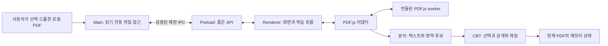

# Local PDF CBT — Project Bible

- 문서 버전: `0.2.7`
- 작성일: 2026-08-31
- 갱신일: 2026-09-03
- 상태: Unit 3.0 CBT 상태·소유 관계 구조 검토 완료. 앱은 버전 0.2.7이며 OPEN-09와 Unit 1.0은 미해결
- 현재 산출물: Unit 2.7.2 원문 Viewer Shell과 Phase 2 분석 계약, Unit 3.0의 Question/Region/Answer/Attempt v1 및 CBT 준비 상태·무효화 계약. 안전한 Mask·정답 추출·선택·공개·채점 UI는 아직 구현하지 않았으며, Unit 4.1의 첫 MVP 수동 영역 확정이 Unit 3.1보다 먼저 필요하다.
- 적용 순서: 사용자의 명시적 지시 → 승인된 Project Bible → ROADMAP → DECISIONS → 구현.
- 문서의 **제안**은 사용자 요구와 구별한다. 이번 개발 승인은 사용자가 명시한 Unit 3.0 구조 검토에 한하며 Mask·정답 추출·CBT UI 구현 승인을 뜻하지 않는다.

관련 문서: [개발 계획](ROADMAP.md), [요구사항 검토·기술 결정](DECISIONS.md), [변경·Unit 완료 기록](CHANGELOG.md), [후속 아이디어](IDEA_PARKING.md).

## 1. 프로젝트 목적

사용자가 소유한 문제·보기·해설·정답 PDF를 로컬에서 열어, 답과 해설을 가린 상태로 객관식 문제를 풀게 한다. 답 선택 → 답 확인 → 해당 문제의 해설 공개 → 가능한 경우 채점이 기본 흐름이다. **원본 PDF는 읽기 전용**이며 가림은 화면에서만 수행한다.

사용자가 Unit 2.2 완료 뒤 **Unit 2.3 제목 키워드 탐색과 Unit 2.4 해설·정답 영역 추정을 순서대로 명시적으로 요청**했다. Unit 2.3은 원래 Text Item 순서와 `hasEOL`로 제목 문맥 후보를 찾고, Unit 2.4는 같은 페이지의 검증된 PDF user space bbox와 후보를 결합해 시작·끝 경계와 `해설→정답`/`정답→해설` 순서의 영역 후보를 만든다. 중복 제목, 읽기 순서 충돌, 다단 가능성, 회전·세로쓰기에는 영역을 만들지 않고 보류한다. 마지막 영역과 이미지·수식 포함 여부는 입증할 수 없으므로 명시적인 제한 사유를 유지한다. Unit 2.5는 명시적인 개발 실행 옵션에서만 Text Item, 키워드 근거와 영역 후보 좌표를 같은 Canvas 위에 표시해 sourceIndex·bbox·확대·높이 맞춤·창 크기·고유 회전을 대조한다. Unit 2.6은 기존 근거를 새로 추측하지 않고 첫 MVP 분석 프로파일의 `profile-match / not-supported / hold`만 판정한다. `profile-match`도 이미지·수식과 닫힌 마지막 경계, 안전한 Mask, Question 소유 관계가 확인되지 않아 `canStartCbt: false`를 유지한다. 일반 UI에는 원문·좌표 대신 판정 요약만 표시한다. Unit 2.7은 분석 규칙을 바꾸지 않고 Viewer Shell을 정리하고, 2.7.1은 임시 Canvas로 검은 공백 전환을 막는다. Unit 2.7.2는 로딩 안내를 레이아웃과 분리하고 실제 목표 배율이 달라질 때만 높이 맞춤 자동 렌더를 실행해 페이지 이동·창 크기 변경의 덜컥거림을 막는다. 앱과 package.json은 0.2.7이며 Unit 1.0 미착수와 OPEN-09는 그대로 남는다.

Unit 3.0은 Phase 2의 모든 `canStartCbt: false`를 그대로 받아들인다. 프로파일을 더 좁히거나 합성 샘플을 추가하는 것만으로는 이미지·수식 경계와 Question 소유권을 입증할 수 없으므로, **Unit 4.1의 첫 MVP 수동 해설·정답 영역 확정 기능을 Unit 3.1보다 먼저 진행**한다. 사용자가 원문을 보며 한 페이지의 한 문제에 속한 해설·정답 영역을 각각 확인한 뒤에만 Question/Region이 `confirmed`가 된다. 이 결정은 자동 Mask나 CBT를 구현한 것이 아니며 앱과 package.json은 계속 0.2.7이다.

### 첫 MVP 범위 — Unit 3.0 채택

| 구분 | 첫 MVP에서의 처리 |
| --- | --- |
| 실행 대상 | Unit 0.2에서 Windows 11 x64로 확정. 다른 OS/Windows 버전은 현재 지원 검증 대상 아님 |
| UI | 한국어, 한 번에 PDF 한 개와 페이지 한 개 표시 |
| PDF 열람 | 파일 선택, 파일 드롭, 렌더링, 페이지 이동, 확대·축소, 높이 맞춤 |
| CBT 지원 | 검증된 프로파일에 해당하는 단일 열·한 페이지 한 문제. 문제와 해설/정답이 같은 페이지에서 끝나는 형식 |
| 순서 | 문제 → 보기 → 해설 → 정답, 또는 문제 → 보기 → 정답 → 해설 모두 검증 대상 |
| 객관식 | 4지 또는 5지 단일 정답. 보기 수는 자동 추측하지 않고 확인 전 사용자가 선택 가능 |
| 자동 채점 | 정답 영역에서 허용된 표기로 단일 답이 명확히 추출될 때만 시행 |
| 정답 불명 | 해설 가림이 안전하게 추정되면 선택·공개는 가능하되 결과는 `채점 불가` |
| 지원 외 형식 | 가림·문제 대응이 불확실하면 CBT를 시작하지 않음. 안내 후 사용자가 선택하면 원문 열람 |
| 저장 | PDF를 연 동안만 메모리에 선택·공개·채점 상태 유지. 앱 종료, PDF 닫기·교체 시 초기화 |
| 영역 확정 | 한 페이지·한 문제의 해설/정답 사각형을 사용자가 미리보기 후 확정. Unit 4.1 선행 MVP 범위 |
| 제외 | 자동 문제 분리, 여러 문제/열, 페이지 간 연결, 복수·다페이지 수동 영역, 영구 저장, OCR, AI |

이는 범용 PDF 지원 약속을 제한하는 채택 범위다. 해당 제한 없이 임의 PDF를 첫 MVP에서 지원하려면 문제 분리와 수동 보정 확장 일정을 다시 검토해야 한다. 검증되지 않은 파일을 지원 형식으로 단정하지 않는다.

## 2. Local First 원칙

1. 설치된 앱의 기본 기능은 인터넷 없이 동작한다. 계정·로그인·서버를 요구하지 않는다.
2. PDF, 추출 텍스트, 파일명, 경로, 답안, 로그를 외부로 자동 전송하지 않는다. 분석·크래시 업로드·원격 글꼴·CDN·자동 업데이트 확인을 기본 기능에 넣지 않는다.
3. PDF.js worker와 필요한 CMap·표준 글꼴·WASM 등 렌더링 자산은 앱에 함께 포함하고 패키지 안에서 읽는다. 해당 자산 경로를 지정할 수 있음은 [PDF.js 로딩 API](https://mozilla.github.io/pdf.js/api/draft/api.js.html)에 근거한다.
4. 개발 의존성 다운로드에는 인터넷이 필요할 수 있다. 이는 설치 후 사용 시 오프라인 동작과 구별한다. 개발 서버는 로컬 루프백에만 바인딩하고 배포 앱에는 포함하지 않는다.
5. 향후 AI는 별도 선택 기능이다. 끄거나 연결에 실패해도 파일 열람·풀이·채점·저장은 정상 동작해야 한다.

## 3. 기술 스택

| 기술 | 역할 | 기준 |
| --- | --- | --- |
| Electron | 로컬 데스크톱 창·파일 접근·실행 환경 | 유지보수 중인 안정판을 Unit 0.2에서 검증 후 고정 |
| Node.js LTS / npm | 개발·빌드 도구 | 개발용 Node와 Electron 내장 Node는 별도 런타임 |
| Vite | renderer 개발 서버와 정적 자산 번들 | Vanilla JavaScript 구성 |
| JavaScript / HTML / CSS | UI와 도메인 로직 | React, Vue, TypeScript 전환은 현재 범위 밖 |
| PDF.js / `pdfjs-dist` | PDF 표시·텍스트 추출 | 본체·worker·자산 버전을 동일하게 고정 |
| SQLite / Chart.js / AI | 이후 저장·통계·선택적 확장 | 필요한 Phase 전에는 설치·구현하지 않음 |

Unit 0.2에서 고정한 Electron 44.0.0, Vite 8.2.2, Electron Packager 20.3.0, Prettier 3.9.6을 유지한다. Unit 0.4에서 Node 24.19.0/24.20.0과 npm 11.19.0을 검증하고 packageManager를 npm 11.19.0으로 갱신했다(이전 npm 기준 10.8.2). 직접 의존성은 정확한 버전, 전체 의존성은 lockfile로 관리한다. 개발 Node는 24.19 이상인 24 LTS로 제한하고 `.node-version`은 24.19.0을 유지한다. Electron 내장 Node는 별도로 관리된다. [Node.js 지원 정책](https://nodejs.org/en/about/previous-releases), [Vite 환경 요구사항](https://vite.dev/guide/).

환경 검사는 Node 내장 테스트 실행기와 개발 전용 playwright-core 1.62.1을 사용한다. 별도 브라우저·제품 런타임 의존성은 추가하지 않으며 테스트 도구는 앱 패키지에 포함하지 않는다.

Unit 1.3에서 `pdfjs-dist` 6.3.289를 정확한 버전으로 고정했다. 본체와 worker를 같은 패키지에서 빌드하고 CMap·ICC·표준 글꼴·WASM·라이선스를 로컬 자산으로 포함한다. 실행·설치 방법은 [README](../README.md), 버전·자산·렌더 수명 결정은 DECISIONS의 ADR-020을 따른다.

## 4. 전체 아키텍처

아래는 전체 목표 설계다. 선택·드롭은 같은 main 읽기 전용 경계를 사용하고 승인된 PDF의 이름·크기·바이트만 renderer에 전달하며 경로는 반환하지 않는다. PDF 어댑터는 PDF.js document/page/TextContent 객체와 worker·렌더·추출 수명을 소유한다. 분석 모듈에는 버전 있는 순수 데이터 레코드만 전달하고, Unit 2.3의 분석 모듈은 페이지 텍스트 품질, PDF user space bbox, 제목 키워드 후보까지 만든다. UI는 어댑터나 분석 모듈의 원시 객체·추출 원문·좌표·후보 문자열을 보관하지 않고 공개 상태 요약만 표시한다. 영역·CBT·데이터 저장 코드는 아직 없다. [Electron 프로세스 모델](https://www.electronjs.org/docs/latest/tutorial/process-model).



| 경계 | 책임 | 하지 않는 일 |
| --- | --- | --- |
| Main | 창 수명, 파일 선택·드롭 검증·읽기, IPC 검증. 영구 저장은 이후 추가 | 문제 인식, 채점, PDF 스크립트 실행 |
| Preload | 사용 목적별 허용 API만 노출 | 범용 파일 읽기·쓰기, 원시 IPC 노출 |
| PDF 어댑터 | 열기·페이지·렌더·추출·취소·자원 해제·좌표 변환 | 문제 의미 판단, 학습 상태 보관 |
| 분석 모듈 | 입력 정규화, 키워드·블록·영역 후보, 근거·실패 이유 | DOM 조작, 정답을 사용자에게 공개할지 결정 |
| CBT 모듈 | 선택·공개 상태 전이, 결정적 채점 | PDF 내부 구조, 파일 접근 |
| UI | 상태 표시, 입력 전달, 레이어 배치 | 독자적인 채점 규칙이나 원본 데이터 변경 |

분석은 PDF.js 원시 객체 대신 작은 데이터 레코드를 받는다. 의존성 방향은 UI → 기능 서비스 → 순수 데이터/규칙이며, PDF 어댑터 밖으로 PDF.js 객체가 퍼지지 않게 한다. 향후 저장·OCR·AI를 연결할 경계만 정의하고 범용 플러그인 프레임워크나 빈 서비스 구현을 미리 만들지 않는다.

## 5. 폴더 구조

현재 프로젝트 문서 루트는 `outputs/local-pdf-cbt/docs/`이다. `local-pdf-cbt/`를 프로젝트 루트로 사용할 수 있도록 문서 내부 경로는 모두 상대 경로로 유지한다. 프로젝트를 이동해도 연결이 유지되어야 한다.

**Unit 2.7.2 완료 시점의 현재 구조:**

```text
local-pdf-cbt/
├─ docs/                기준 문서 5개
├─ electron/            main·preload·로컬 프로토콜·PDF 선택/드롭/검사
├─ src/main.js          화면 초기화
├─ src/pdf/             PDF.js 어댑터·요청 취소·자원 정리·viewport 좌표 변환
├─ src/analysis/        텍스트 품질·TextItemRecord bbox·제목/영역 후보·지원 프로파일 판정
├─ src/shared/          PageTextSource v1 검증과 계약 버전
├─ src/ui/              실행 환경·파일 입력·페이지·배율·Canvas·분석 상태 표시
├─ src/styles/          기본 스타일·Shell 배치
├─ scripts/             Node 검사·개발 실행·패키징
├─ tests/               보안 경계·PDF 어댑터·실제 Electron 환경 검사와 합성 PDF
├─ index.html
├─ vite.config.js
├─ package.json
├─ package-lock.json
└─ README.md
```

**현재 구조에 필요한 Unit에서만 추가·확장할 책임:**

```text
electron/             main, preload, 제한 IPC와 로컬 입출력
src/app/              앱 상태와 기능 간 조정
src/pdf/              PDF.js 어댑터와 좌표 변환
src/analysis/         텍스트·패턴·영역 분석
src/cbt/              선택·공개·채점
src/ui/               화면 요소와 레이어
src/styles/           스타일과 UI 토큰
src/shared/           실제로 공유되는 설정·데이터 계약
tests/                필요한 로직·통합·시나리오 검증
tests/fixtures/       재배포 가능한 합성 PDF와 기대 결과
```

빌드 설정과 패키지 파일은 Unit 0.2에서 추가했고 Unit 0.4에서 실제 Windows x64/ASAR 패키지를 검증했다. 사용자 PDF, 학습 데이터, 로그, 빌드 산출물, 비밀 값은 Git에 넣지 않는다. 저장 서비스 폴더는 저장 기능에 착수할 때 만든다. 앱 ASAR에는 electron/·dist/·package.json만 포함한다. release/와 work/는 각각 생성된 앱과 검증 자료용이며 소스·Git 대상이 아니다.

## 6. 개발 원칙

- 한 Unit의 목적과 완료 조건을 먼저 정한다. 다음 기능을 편의상 끼워 넣지 않는다.
- 정상 동작 중인 기능을 임의로 제거하거나 의미를 바꾸지 않는다. 리팩토링은 이유·영향·회귀 확인을 기록한다.
- 함수·모듈의 책임을 작게 유지한다. 한 파일이 파일 접근, PDF 분석, UI, 채점을 모두 맡지 않는다.
- 비동기 결과는 문서·페이지·렌더 요청 식별자로 검증한다. 취소된 이전 요청이 새 화면이나 답안 상태를 덮어쓰면 안 된다.
- 모든 페이지를 고해상도 Canvas로 상주시키지 않는다. 현재 페이지 중심으로 렌더하고 취소·정리 경로를 둔다. [PDF.js 메모리 안내](https://github.com/mozilla/pdf.js/wiki/Frequently-Asked-Questions#i-want-to-render-all-100-pages-in-a-document-at-a-high-resolution-is-it-a-good-idea).
- 구조 검토는 PDF 영역 분석, 문제 자동 분리, SQLite, 시험 모드, OCR, AI 착수 전 필수다. 동작 시연만으로 통과시키지 않는다.

## 7. 코딩 규칙

- JavaScript는 ES Modules를 기본으로 한다. sandbox preload의 모듈 형식 등 런타임 제약으로 필요한 예외는 DECISIONS에 기록한다.
- 2칸 들여쓰기, 세미콜론, 작은따옴표를 기본으로 하고 Unit 0.2에서 고정한 Prettier 설정을 따른다. 기존 문서의 불필요한 전체 재정렬은 피한다.
- 공개 함수와 데이터 계약은 JSDoc으로 입력·출력·실패 상태를 설명한다. 주석은 동작 나열보다 제약의 이유를 남긴다.
- `const` 우선, 불필요한 전역 상태 금지, 사용자/PDF 텍스트는 HTML로 삽입하지 않는다.
- 예상 가능한 취소·미지원·손상은 명시적 상태로 처리한다. 예외를 무시하거나 오류 로그를 숨겨 완료 조건을 맞추지 않는다.
- 임계값·키워드·여백·메모리 제한은 이름 있는 설정값으로 관리한다. 샘플의 좌표를 일반 규칙처럼 하드코딩하지 않는다.

## 8. 네이밍 규칙

| 대상 | 규칙 / 예 |
| --- | --- |
| 파일·디렉터리 | `kebab-case`, 예: `pdf-adapter.js`, `answer-parser.js` |
| 함수·변수 | `camelCase`, 예: `extractAnswer`, `selectedChoice` |
| 타입 문서·클래스 | `PascalCase`, 예: `Question`, `Attempt` |
| 상수 | `UPPER_SNAKE_CASE`, 예: `MAX_CANVAS_PIXELS` |
| 불리언 | `is`, `has`, `can`, 예: `canReveal` |
| 식별자 | `documentId`, `questionId`, `regionId`; 서로 바꿔 쓰지 않음 |
| 페이지 | `pageNumber` / 외부 레코드의 `page`는 1부터. 배열 인덱스와 혼용 금지 |
| 단위 | `scale`, `durationMs`, `sizeBytes`; 좌표에는 공간·단위를 명시 |

## 9. PDF 처리 원칙

### 9.0 Phase 2 분석 경계

Unit 2.0은 아래 경계를 승인했고 Unit 2.1~2.6은 추출·품질·좌표·제목/영역 후보·첫 분석 프로파일 판정을 단계별로 구현했다. 이후 책임은 해당 Unit에서만 추가한다.

```text
승인된 PDF bytes
  → PDF adapter: PDF.js document/page/TextContent 수명과 추출
  → PageTextSource v1: 직렬화 가능한 페이지 근거
  → Analysis: 문자열 요약·페이지 품질·후속 후보 판단
  → UI: 진행·품질·실패 요약만 표시
```

- PDF 어댑터만 PDF.js 객체를 소유한다. 분석 모듈이나 UI에 `PDFDocumentProxy`, `PDFPageProxy`, `TextContent`, render task를 반환하지 않는다.
- Unit 2.1에서 어댑터에 `extractPageText({ pageNumber })` 경계를 추가한다. 현재 열린 문서의 유효한 1부터 시작하는 페이지 한 개만 추출하며 전체 문서를 자동 선행 추출하지 않는다. 텍스트 추출 실패가 Canvas 원문 열람을 실패시키면 안 된다.
- 어댑터는 새 문서 open 시도가 시작되거나 dispose될 때 세션 한정 `documentRevision`을 증가시킨다. 성공한 현재 문서 record가 그 revision을 소유하며 값은 파일명·경로·내용 해시가 아닌 불투명한 번호다. 추출 결과에는 revision과 pageNumber를 포함한다. 실패한 새 open도 이전 revision을 무효화하며, 파일 교체·dispose 뒤 이전 revision이나 이전 분석 요청의 늦은 결과는 `canceled`로 버리고 현재 화면·품질 상태를 바꾸지 않는다.
- PDF.js 6.3.289의 `getTextContent({ includeMarkedContent: false, disableNormalization: false })`를 기준으로 검증한다. PDF.js가 반환한 `str`을 `sourceText`로 보존하고 앱이 임의로 원문을 교정하지 않는다. 검색용 정규화·줄/블록 복원·키워드 판단은 이 경계의 책임이 아니다.
- 추출 텍스트·파일 경로·개인 정보는 Console, 자동 진단 파일, 외부 서비스에 기록하지 않는다. 분석 결과는 현재 PDF 세션 메모리에만 두고 파일 교체·새로고침·종료 때 폐기한다.

`PageTextSource v1`은 다음 필드만 갖는 순수 데이터다. 배열과 객체는 새로 복사하며 `NaN`, `Infinity`, 함수, prototype 의존 객체를 허용하지 않는다.

| 필드 | 계약 |
| --- | --- |
| `contractVersion` | 숫자 `1`. 호환되지 않는 변경은 버전을 올리고 묵시적으로 해석하지 않음 |
| `documentRevision` | 현재 앱 세션의 불투명 문서 revision. 영구 ID나 파일 식별자가 아님 |
| `pageNumber`, `pageCount` | 1부터 시작하는 안전한 정수 |
| `language` | PDF.js의 문서 언어 문자열 또는 `null`. 페이지 품질의 단독 근거로 쓰지 않음 |
| `page` | `viewBox[4]`, `userUnit`, 고유 `rotation`. Unit 2.2 좌표 변환 근거이며 Unit 2.1은 의미 좌표를 계산하지 않음 |
| `items` | 원래 순서의 텍스트 항목. 각 항목은 `sourceIndex`, `sourceText`, `direction`, `transform[6]`, `width`, `height`, `fontName`, `hasEOL`만 포함 |
| `styles` | 실제 항목이 참조하는 style의 배열. 각 원소는 `fontName`, `ascent`, `descent`, `vertical`, `fontFamily`만 포함해 임의 fontName을 객체 key로 사용하지 않음. PDF.js가 생략하거나 `NaN`으로 주는 ascent/descent는 계약 진입 시 0, 생략한 vertical은 같은 font의 Text Item direction으로 보수적으로 정규화함 |

Unit 2.1의 `PageTextAssessment v1`은 PageTextSource 또는 현재 문서의 추출 실패 결과를 입력으로 받는 순수 분류 결과다. `documentRevision`, `pageNumber`, `quality`, `reasonCodes[]`, 이름 있는 `metrics`와 진단용 `plainText`를 제공한다. `plainText`는 sourceText를 원래 순서로 이어 붙이고 `hasEOL` 뒤에만 줄바꿈을 넣은 값이다. 항목 사이에 추정 공백을 넣지 않으며 읽기 순서나 문단 복원 결과로 사용하지 않는다. `TEXT_EXTRACTION_FAILED`와 `INVALID_TEXT_SOURCE`에서는 plainText를 빈 문자열로 두고 원문을 추정하지 않는다. `NO_DOCUMENT`, 잘못된 pageNumber, `canceled`에는 assessment를 만들지 않는다. 근거 추적은 sourceIndex와 metric으로 유지하고 사용자 원문 전체를 로그에 쓰지 않는다.

Notion/Chromium 출력 한 건에서 실제 Text Item 111개는 정상이지만 참조 font style 네 개의 ascent/descent가 `NaN`이고 vertical이 생략되는 사례를 확인했다. 이 값은 글꼴 보조 metadata이며 원문·transform·크기·fontName과 분리해 0/방향 기반 기본값으로 정규화한다. `Infinity`, 문자열 metric, 잘못된 Text Item·page metadata는 계속 `INVALID_TEXT_SOURCE`다. source 순서와 `hasEOL`은 추정 보정하지 않으므로 인쇄 머리글·바닥글이 `정답 ④` 뒤에 붙는 출력은 답 제목을 오탐하지 않고 미지원으로 남긴다.

품질 상태의 의미는 다음과 같다. Unit 2.1은 고정 합성 샘플과 설치된 PDF.js 6.3.289의 한글+이미지 fixture를 측정해 `MIN_USABLE_NON_WHITESPACE_CHARACTERS = 12`, `MIN_READABLE_CHARACTER_RATIO = 0.8`을 초기 상수로 정했다. 문자는 Unicode code point로 세고 공백은 문자량과 비율의 분모에서 제외한다. replacement character·제어/비공개 문자처럼 문자·숫자·결합 기호·문장부호·기호로 판독할 수 없는 비공백 문자는 suspicious로 센다. 판독 가능 문자가 12개 이상인데 비율이 0.8 미만이면 `unknown / CONFLICTING_SIGNALS`, 그보다 근거가 적으면 `text-insufficient`로 보류한다. 이 값은 범용 정확도 주장이 아니며 Unit 1.0 실제 샘플 행렬에서 재검토한다.

| `quality` | 의미 | 후속 처리 |
| --- | --- | --- |
| `text-usable` | 추출 성공 후 유효한 비공백 문자열과 문자 품질 근거가 현재 분석 입력으로 사용 가능 | Unit 2.2 이후 분석 후보가 될 수 있음. CBT 지원을 의미하지 않음 |
| `text-insufficient` | 추출은 성공했지만 비어 있음, 공백뿐임, 페이지 번호 수준, 문자량/품질 부족 등 명시적 근거가 있음 | 자동 텍스트 분석 보류. 스캔이라고 단정하지 않음 |
| `unknown` | 추출 실패, 잘못된 레코드, 상충 신호 또는 현재 근거로 판정할 수 없음 | 자동 분석 보류하고 reason code 유지 |

최소 reason code 집합은 `NO_TEXT_ITEMS`, `WHITESPACE_ONLY`, `TOO_LITTLE_TEXT`, `LOW_TEXT_QUALITY`, `INVALID_TEXT_SOURCE`, `CONFLICTING_SIGNALS`, `TEXT_EXTRACTION_FAILED`다. Unit 2.1에서 샘플에 근거해 필요한 코드만 실제 사용하고, 임계값 미충족을 추출 오류로 바꾸지 않는다. 빈 텍스트나 이미지가 있다는 사실만으로 스캔 PDF라고 판정하지 않는다.

페이지와 문제는 계속 분리한다. PageTextSource와 PageTextAssessment에는 `questionId`, 정답, 해설, 영역, 지원 여부를 넣지 않는다. 페이지 번호를 questionId로 사용하지 않는다. PageAnswerRegions는 페이지의 승인 전 후보이며 Question과 questionId에 소유된 Region 생성은 키워드·영역·지원 판정이 끝난 뒤의 별도 Unit 책임이다.

검증 순서는 다음과 같다.

1. Unit 2.1 완료: 한글 분절 항목, 빈/벡터·이미지 위주, 텍스트+이미지 혼합, 페이지 번호 수준, 비정상 문자열 고정 샘플에서 세 상태와 reason code를 확인했다.
2. Unit 2.1 완료: 잘못된 페이지, 문서 없음, 추출 예외, 빠른 페이지 요청, 파일 교체·dispose 후 늦은 결과 폐기를 documentRevision/request id로 확인했다.
3. Unit 2.1 완료: 실제 PDF.js 한글+이미지 fixture에서 6개 item·비공백 73자·판독 비율 1을 확인했고 경로·PDF.js 객체·원문 DOM 비노출, 원본 해시, Viewer와 오프라인 패키지 경계를 확인했다.
4. Unit 2.2 완료: 보존한 transform·style·page metadata로 회전 전 PDF user space의 TextItemRecord bbox를 계산했다. viewBox 오프셋·`UserUnit 2`·0/90/180/270도·50/100/200% 합성 문서를 설치된 PDF.js 6.3.289의 `getViewport()`와 대조했고 Canvas DPR가 CSS 좌표에 섞이지 않음을 확인했다.
5. Unit 2.3 완료: 사용자의 명시적 순서 예외에 따라 7개 제목 키워드, 분절 항목, 문맥과 오탐 억제를 순수 함수·실제 PDF.js fixture·일반 UI 후보 수로 검증했다.
6. Unit 2.4 완료: 사용자의 두 번째 순서 예외에 따라 A/B 순서의 텍스트 영역 후보, 시작·다음 제목 경계, 문제/보기 제외와 보류·제한 사유를 검증했다. 안전한 Mask나 지원 판정으로 승인하지 않았다.
7. Unit 2.5 완료: 일반 사용자 기능과 분리한 Debug Overlay에서 sourceIndex, bbox와 기존 키워드·영역 후보 근거를 실제 PDF.js Canvas에 시각 대조했다. 50–200% 확대, 높이 맞춤·창 크기 변경과 0/90/180/270도 고유 회전에 다시 투영하고 원문 문자열은 Overlay DOM에 복사하지 않는다.
8. Unit 2.6 완료: A/B 고정 후보 2개와 미지원·보류 6개를 분리했다. 후보의 보호 대상 Text Item 누락 0/6, 문제 Text Item 침범 0/3, 미지원 샘플 오일치 0/6, 전체 보류 4/8을 기록했다. 이는 합성 Text Item 근거 측정이며 픽셀·이미지·수식 가림 검증이 아니다. 따라서 CBT 착수 가능 판정은 0/8이다.
9. Unit 2.6 보완: 실제 Notion/Chromium 출력 한 건에서 생략된 font 보조값 때문에 전체 TextContent가 무효화되던 호환성 오류를 수정했다. 111개 Text Item·비공백 186자·판독 비율 1을 `text-usable`로 보존했으며, footer가 답 값 뒤에 이어진 source 순서는 추정하지 않아 정답 제목 누락 미지원으로 안전하게 남겼다.
10. Unit 2.7 완료: 기본 1120×760 창에서 document root 스크롤이 생기지 않고 header·main·footer가 한 화면에 유지됨을 확인했다. 문서 정보 아코디언은 키보드로 열고 닫을 수 있으며, 접힌 동안에도 텍스트·키워드·영역·지원 프로파일 요약은 계속 보인다. 640×480에서는 main 내부 스크롤로 모든 영역에 접근하고, 높이 맞춤은 PDF가 가용 영역을 넘지 않으면서 그 높이의 85% 이상을 사용하도록 세 실행 모드에서 회귀 검증했다.
11. Unit 2.7.2 완료: 페이지 로딩 안내가 나타나도 PDF page stage의 top·height가 1 CSS px보다 크게 바뀌지 않고, 높이 맞춤·창 크기 자동 렌더가 완료된 뒤 450ms 동안 화면 Canvas가 다시 교체되지 않음을 개발·빌드·패키지 세 모드에서 확인했다.
12. Unit 3.0 완료: Question/Region/Answer/Attempt v1의 소유·상태·무효화 계약과 CBT 준비 관문을 문서로 확정했다. 현재 자동 후보를 Question으로 승격하지 않으며 Unit 4.1의 사용자 확인 수동 영역 지정을 Unit 3.1보다 먼저 진행한다. 문서 전용 Unit이므로 런타임 검증은 해당 없다.

### 9.1 추출과 분석은 다른 일이다

`getTextContent()`는 텍스트 항목을 제공한다. 항목의 `str`, `transform`, `width`, `height`, `dir`, `hasEOL` 등을 이용할 수 있지만 문제·해설이라는 의미는 앱이 판단해야 한다. [PDF.js TextItem 계약](https://mozilla.github.io/pdf.js/api/draft/module-pdfjsLib.html#~TextItem).

Text Content는 분석 입력이고 Text Layer는 표시·선택을 위한 DOM이다. 렌더된 DOM의 순서나 화면 픽셀을 분석의 원본으로 사용하지 않는다. 텍스트 추출 가능 여부와 정상적인 읽기 순서·한글 품질은 별도로 검증한다.

Unit 2.2의 `PageTextCoordinates v1`은 `documentRevision`, `pageNumber`, `coordinateSpace`, 복사한 page metadata와 `TextItemRecord[]`를 제공한다. 각 TextItemRecord는 `sourceIndex`, `text`, `x`, `y`, `width`, `height`, `page`만 가진다. 이 필드는 PageTextSource를 그대로 복사한 것이 아니라 아래 좌표 계약으로 정규화한 값이다. raw transform과 font 정보는 근거 추적을 위해 PageTextSource에만 유지한다.

### 9.2 좌표 계약

- 저장·분석의 기준은 **페이지의 회전 전 PDF user space**다. `coordinateSpace: pdf-user-space`, `x/y: 추정 bbox의 최소 좌표`, `width/height: bbox의 크기`로 정의한다. 단위는 PDF user unit이며 무조건 CSS px 또는 1/72 inch로 취급하지 않는다.
- 페이지의 view box, `userUnit`, 고유 회전을 함께 보관한다. 텍스트 기준선의 transform 위치를 bbox 왼쪽 위라고 단정하지 않는다. 글꼴 ascent/descent와 회전된 모서리를 고려한 경계 상자는 근사치이며 실물 검증이 필요하다.
- 화면 배치는 동일 viewport로 모든 모서리를 변환한 후 CSS px 경계를 계산한다. Canvas의 고해상도 픽셀 배율과 overlay의 CSS 좌표를 분리한다. 확대·맞춤·회전·창 크기 변경마다 다시 투영한다.
- PDF ↔ viewport 변환, 회전, view box, userUnit 처리는 PDF.js 공개 변환을 우선 사용한다. [PageViewport 공식 소스](https://raw.githubusercontent.com/mozilla/pdf.js/master/src/display/page_viewport.js), [HiDPI 렌더링 예제](https://mozilla.github.io/pdf.js/examples/).
- 가로쓰기 bbox는 transform의 기준선 축과 `width`, 글꼴 축과 ascent/descent를 조합하고 네 모서리의 최소·최대값을 쓴다. 세로쓰기는 transform의 교차축과 진행축을 사용한 보수적 근사값이다. ascent/descent가 모두 0일 때만 이름 있는 기본값 0.8/-0.2를 사용한다. 유효하지 않은 page·font·text geometry는 부분 결과 없이 `UNSUPPORTED_*` 코드로 보류한다.
- viewport 좌표는 PDF.js 6.3.289 `PageViewport`와 같은 viewBox·`userUnit`·고유 90도 단위 회전 규칙을 순수 데이터로 구현하고 실제 `PDFPageProxy.getViewport()` 결과와 대조했다. 확대 배율은 CSS 좌표에만 적용하고 Canvas device pixel ratio는 입력이나 결과에 포함하지 않는다.
- bbox는 글리프 윤곽·클리핑 영역·정확한 잉크 경계가 아닌 근사 축 정렬 사각형이다. 회전·반사 transform의 네 모서리 계산과 sourceIndex별 실제 PDF.js Canvas 대조는 Unit 2.5 합성 fixture에서 확인했다. 이 결과는 모든 글꼴·클리핑·실제 출판물의 잉크 경계를 보장하지 않는다. Unit 2.3 키워드 후보는 bbox를 사용하지 않으며 줄의 시각 위치·블록·영역 의미는 계산하지 않는다.

### 9.3 개발자용 Debug Overlay 계약

- Debug Overlay는 일반 사용자 기능이 아니다. main 프로세스가 명시적인 `--debug-overlay` 실행 옵션을 받은 경우에만 renderer URL에 내부 진단 표식을 붙인다. 일반 `npm run dev`, 빌드 실행과 패키지 직접 실행에는 panel과 overlay DOM을 만들지 않는다.
- 현재 페이지의 PageTextCoordinates v1, PageKeywordCandidates v1, PageAnswerRegions v1 중 이미 존재하고 revision·pageNumber가 일치하는 근거만 사용한다. 새로운 키워드·영역·정답을 추론하거나 후보를 지원·Mask 승인으로 바꾸지 않는다.
- overlay는 Canvas와 같은 `.pdf-page-surface` 안에서 CSS px로 배치한다. PDF.js와 같은 viewport 변환 후 실제 Canvas CSS 크기의 반올림 차이를 보정하며 device pixel ratio와 backing bitmap 좌표를 섞지 않는다. 확대·축소, 높이 맞춤, 창 크기와 고유 회전 변화마다 현재 근거를 다시 투영한다.
- Text Item은 `T{sourceIndex}`, 키워드 근거는 `K{candidateIndex}`, 영역 후보는 `R{regionIndex}`와 구분된 선으로 표시한다. 전체 PDF 문자열, 정답 값, 파일 경로와 PDF.js 객체는 진단 모델·panel·overlay DOM에 복사하지 않는다.
- 불충분·확인 불가 텍스트와 계약 불일치는 부분 좌표를 만들지 않고 공개 reason code나 진단 불가 안내로 끝낸다. Overlay를 숨겨도 분석 결과를 공개하거나 저장하지 않으며 파일 교체·페이지 변경·새로고침·종료 시 세션 근거를 폐기한다.
- 이 시각 대조는 합성 PDF와 현재 Windows 화면에서 좌표 파이프라인을 확인한 결과다. Unit 2.6은 합성 Text Item 수준의 누락·침범만 별도로 측정했다. 글리프 윤곽, 이미지·수식, 클리핑, 실제 출판물 전체와 픽셀 수준 누출은 계속 미확정이다.

### 9.4 제목 키워드 후보 계약

Unit 2.3의 `PageKeywordCandidates v1`은 PageTextSource v1과 같은 revision·pageNumber를 가진 `text-usable` PageTextAssessment v1만 입력으로 받는다. `text-insufficient`와 `unknown`은 `TEXT_NOT_USABLE`로 검색을 보류하고 reason code를 유지한다. source나 assessment가 서로 맞지 않으면 원문 없는 공개 실패 코드를 반환한다.

- 키워드 목록은 `해설`, `풀이`, `정답`, `답`, `Answer`, `Solution`, `Explanation` 일곱 개다. 영문은 대소문자를 구분하지 않으며 더 긴 키워드를 먼저 검사한다.
- PageTextSource의 항목 순서를 그대로 사용하고 `hasEOL`에서만 논리 줄을 끝낸다. 같은 줄의 분리된 항목은 원문 문자열을 그대로 이어 붙여 `정`+`답` 같은 후보를 찾지만 추정 공백·문자·시각적 줄 순서를 만들지 않는다.
- 공백이나 제한된 글머리표 뒤의 줄 시작에서만 제목을 찾는다. 단독 제목, 구분 기호, 해설/풀이 뒤 본문, 정답/답 뒤 허용 답 표기(①~⑩, 1~10, A~G)를 문맥으로 구분한다.
- `정답을 고르시오`, `답변`, `해설서`, `풀이과정`, 본문 중간의 `Answer`, `Answer choices`, `Solution manual`, `Explanation guide` 같은 고정 오탐 사례는 후보에서 제외한다. 이 목록은 실제 출판물 전체를 포괄한다는 정확도 주장이 아니다.
- 후보 근거는 canonicalKeyword, 실제 일치한 키워드, 언어·종류·문맥, 단일/분절 matchMode, sourceIndexes, 1부터 시작하는 논리 줄 번호만 가진다. 전체 주변 문장, bbox, region, questionId, 정답 값은 포함하지 않는다.
- 일반 UI는 후보 원문을 표시하거나 보관하지 않고 현재 페이지의 후보 개수 또는 보류 상태만 알린다. 후보가 있어도 해설/정답 영역, 올바른 답, Question 또는 CBT 지원이 확인된 것은 아니다.

### 9.5 해설·정답 영역 후보 계약

Unit 2.4의 `PageAnswerRegions v1`은 같은 documentRevision·pageNumber의 PageTextSource v1, `text-usable` PageTextAssessment v1, PageTextCoordinates v1, PageKeywordCandidates v1만 입력으로 받는다. 각 계약과 페이지 geometry가 맞지 않으면 원문 없는 공개 실패 코드를 반환하고 `text-insufficient/unknown`은 기존 reason code와 함께 보류한다.

- PageTextSource의 항목 순서와 `hasEOL`로 만든 논리 줄마다 TextItemRecord bbox의 합집합을 계산한다. 원문 문자열을 영역 결과에 복사하거나 추정 공백·문단을 만들지 않는다.
- 제목 줄을 시작 경계로 삼고 다음 제목 바로 앞을 끝 경계로 삼는다. 다음 제목이 없으면 Text Content 끝까지 후보를 만들되 `OPEN_ENDED_LAST_REGION`을 기록해 닫힌 경계로 승인하지 않는다.
- 해설·정답 제목이 각각 하나인 `solution-then-answer`와 `answer-then-solution`을 구별한다. 한 종류만 있으면 단일 후보와 누락 사유를 남긴다. 결과는 한 영역의 여러 줄을 `textRects[]`로 유지하며 문제·보기처럼 첫 제목 전의 줄은 포함하지 않는다.
- 같은 종류 제목이 여러 개이면 다문제 가능성이 있으므로 영역을 만들지 않는다. source 순서와 Y 진행이 충돌하거나 같은 높이에 큰 수평 간격이 있는 다단 가능성, 고유 회전, 세로쓰기도 현재 읽기 순서를 입증할 수 없어 `uncertain`으로 보류한다.
- 모든 후보는 `coverage: text-bounds-only`와 `NON_TEXT_CONTENT_UNVERIFIED`를 가진다. 텍스트 bbox로 이미지·수식·클리핑 영역을 확인할 수 없으므로 후보가 있어도 완전한 가림을 뜻하지 않는다.
- 결과에는 계약 버전, revision, pageNumber, 순서, 근거 sourceIndexes·논리 줄 범위, 회전 전 PDF user space bounds/rects, 공개 reason code만 포함한다. 전체 주변 문장·questionId·정답 값·Mask 승인·지원 판정은 포함하지 않는다.
- 일반 UI는 후보 원문·좌표를 노출하거나 장기 보관하지 않고 개수·없음·보류와 `안전한 가림은 아직 확인하지 않았습니다`만 표시한다.

고정 Y 이하 전체 가리기와 키워드 일치만으로 자동 공개·채점하는 방식은 계속 금지한다. PageAnswerRegions는 Unit 2.5 시각 대조와 Unit 2.6 프로파일 판정의 세션 후보 자료이며 Mask나 Question 소유 영역이 아니다.

### 9.6 첫 MVP 분석 프로파일 판정 계약

Unit 2.6의 `PageSupportProfile v1`은 같은 revision·pageNumber의 PageTextAssessment v1과, 텍스트가 usable일 때 PageKeywordCandidates v1·PageAnswerRegions v1을 검증한 뒤 기존 근거만 분류한다. 결과에는 계약 버전, 불투명한 revision, pageNumber, profileId, 판정·사유와 개수/순서/종류 요약만 두며 PDF 원문·좌표·정답 값·경로·Question을 복사하지 않는다.

- 첫 프로파일 ID는 `single-page-single-column-two-headings-v1`이다. usable 텍스트, 정확히 한 해설 제목과 한 정답 제목, 정확히 두 영역, `solution-then-answer` 또는 `answer-then-solution`, 첫 제목 앞 문제 내용과 각 영역 본문 근거가 모두 있어야 `profile-match`다.
- 제목이 없거나 두 제목을 갖추지 못하면 `not-supported`다. 텍스트 불충분/확인 불가, 중복 제목, 읽기 순서·다단 가능성, 회전·세로쓰기처럼 근거가 모호하면 `hold`다. 일반 UI는 이 세 상태의 요약과 공개 reason code만 표시한다.
- `profile-match`는 분석 규칙과의 일치일 뿐 CBT 지원 승인이 아니다. 모든 일치 결과는 `NON_TEXT_CONTENT_UNVERIFIED`, `OPEN_ENDED_LAST_REGION`, `SAFE_MASK_NOT_VERIFIED`, `QUESTION_OWNERSHIP_NOT_ESTABLISHED`를 유지하고 `canStartCbt: false`를 반환한다.
- 고정 행렬 8개에서 A/B 후보 2/2 일치, 보호 대상 Text Item 누락 0/6, 문제 Text Item 침범 0/3, 미지원 6개 오일치 0/6을 확인했다. 판정 분포는 profile-match 2/8, not-supported 2/8, hold 4/8(50%)이며 CBT 착수 가능은 0/8이다.
- 이 행렬은 재배포 가능한 합성 Text Item과 두 실제 PDF.js 합성 fixture에 한정된다. 실제 출판물·사용자 대표 PDF, 이미지·수식·글리프·클리핑과 픽셀 수준 누출/과다 가림은 검증하지 않았다. Unit 1.0 샘플 행렬과 안전한 Mask/Question 소유 관계 증거 전에는 Phase 3의 실제 가림을 지원한다고 선언하지 않는다.

### 9.7 스캔·혼합 문서

문서 전체를 이분법으로 분류하지 않고 **페이지별** `text-usable`, `text-insufficient`, `unknown` 상태를 둔다. 빈 텍스트는 스캔뿐 아니라 빈 페이지·윤곽선 글자·인코딩 문제일 수 있다. 페이지 번호만 추출되거나 OCR 텍스트가 깨진 페이지도 분석 불충분일 수 있다.

문자량·좌표 유효성·문자 품질을 먼저 보고, 필요 시 이미지 연산과 면적을 보조 신호로 검토한다. 임계값은 Unit 2.1 샘플 검증으로 정한다. MVP는 `스캔 또는 텍스트 분석 불가`라고 안내하며 OCR을 자동 실행하지 않는다. 혼합 PDF의 한 페이지 실패가 나머지 페이지 열람을 막지 않게 한다.

### 9.8 화면 레이어와 공개

아래는 동일 페이지 컨테이너 안에서 아래 → 위 순서다.

```text
PDF Canvas                 원본 페이지 렌더링
Text Layer                 선택 가능한 텍스트, 가린 내용의 우회 노출 방지
Answer/Solution Mask Layer questionId에 연결된 불투명 사각형들
CBT Interaction Layer      현재 문제의 상호작용과 상태
Loading/Uncertain Cover    준비 전·실패 시 페이지 전체를 가리는 임시 덮개
```

- MVP 기본은 불투명 Overlay다. Blur/Mosaic의 시각 효과는 이후 검토한다. 원본 PDF와 원본 렌더 픽셀을 수정하는 편집 기능이 아니다.
- CBT에서는 분석·Canvas·Text Layer·Mask가 모두 준비될 때까지 전체 덮개를 유지한다. 새 페이지나 확대 과정에서 정답이 한 프레임 먼저 보여서는 안 된다.
- 불확실하면 전체 덮개를 유지하고 이유, 다시 시도, 명시적인 `원문 보기` 선택을 제공한다. 원문 보기는 정답 노출 가능성을 알리고 해당 페이지를 풀이 대상에서 제외한다.
- `답 확인`은 현재 `questionId`의 마스크만 공개한다. 페이지 이동이나 확대는 공개 명령이 아니다. 여러 문제·여러 페이지용 소유 관계는 데이터로 준비하되 기능 구현은 Phase 4다.
- 가린 텍스트는 선택·복사·포커스·접근성 읽기 경로에서도 우발적으로 드러나지 않도록 처리한다. 가능하면 해당 span을 제외하고, 경계가 불명확하면 해당 페이지 Text Layer 상호작용 전체를 공개 전 비활성화한다. 접근성 제한은 숨기지 않고 기록한다.
- 이 장치는 학습 보조다. 개발자 도구·원본 파일 접근 등을 막는 DRM이나 시험 부정행위 방지 기능이 아니다.
- Phase 1~2의 개발용 PDF/Debug 화면은 CBT가 아니며 원문이 노출될 수 있음을 표시한다. MVP의 공개 전 차단 조건은 Unit 3.1 이후 적용한다.

### 9.9 Unit 3.0 CBT 준비 상태와 소유 관계

Unit 3.0은 문서 전용 구조 검토다. Phase 2의 `PageAnswerRegions`와 `PageSupportProfile`은 계속 승인 전 후보이며 이를 `Question`이나 `Region`으로 자동 승격하지 않는다. 현재 고정 샘플의 CBT 준비 가능 결과는 0건이므로 앱은 계속 원문 Viewer로만 동작한다.

첫 MVP의 안전 경로는 다음과 같다.

1. 사용자가 원문이 보이는 별도 설정 화면에서 한 페이지·한 문제의 해설 영역과 정답 영역을 직접 지정한다. 설정 화면은 CBT가 아니며 정답이 보일 수 있음을 표시한다.
2. 자동 후보가 있으면 초안의 참고 근거로만 쓸 수 있다. `profile-match`나 후보 좌표만으로 확인을 대신하지 않는다.
3. 동일한 `documentRevision`과 `pageNumber` 안에서 해설·정답 영역이 각각 하나이고 유효한 PDF user space 사각형이며 서로 겹치지 않을 때만 미리보기를 허용한다.
4. 사용자가 가림 미리보기를 확인해야 `Question.setupStatus`와 두 `Region.confirmation`을 한 번에 `confirmed`로 바꾼다. 부분 확정은 없다.
5. 파일·revision·페이지가 바뀌거나 확정 영역을 다시 편집하면 관련 Question, Answer, Attempt와 Mask 준비 상태를 즉시 무효화한다.
6. Unit 4.1의 위 기능과 좌표 왕복 검증을 마치기 전에는 Unit 3.1 Mask Layer를 시작하지 않는다. 영구 저장은 Phase 5까지 하지 않는다.

`CbtReadiness v1`은 저장 레코드가 아닌 파생 상태다.

| 상태 | 진입 조건과 처리 |
| --- | --- |
| `blocked` | 문서/페이지 불일치, 설정 미확정, 영역 오류, 렌더·Mask 미준비 중 하나라도 존재. CBT를 시작하지 않음 |
| `ready` | 같은 revision의 확정 Question과 해설·정답 Region, 현재 viewport에 투영된 불투명 Mask, Canvas와 공개 우회 차단이 모두 준비됨 |
| `active` | `ready` 상태에서만 풀이를 시작. 현재 questionId의 Attempt만 변경 가능 |
| `original-view` | 사용자가 정답 노출 가능성을 확인하고 원문 보기를 선택한 상태. 해당 페이지는 현재 CBT 대상에서 제외 |

`ready` 판정은 프로파일 일치와 독립적이다. 준비 중에는 `Loading/Uncertain Cover`를 유지하고 준비 상태를 한 번에 전환한다. 확대·높이 맞춤·창 크기·페이지 이동 때 기존 공개 상태를 바꾸지 않으며, 새 viewport의 Mask가 준비되기 전에 새 페이지 프레임을 공개하지 않는다. Debug Overlay와 수동 설정 화면은 `active`와 동시에 켤 수 없다.

소유 관계는 다음 불변 조건을 따른다.

- 첫 MVP의 Question은 하나의 세션 문서 revision과 페이지 하나에 속한다. 페이지 번호, 표시 문제 번호, 파일명은 questionId가 아니다.
- 각 Region은 정확히 하나의 Question에 속하고, 첫 MVP에서는 하나의 Question이 `solution` 하나와 `answer` 하나를 가진다. Region 공유와 여러 페이지 연결은 Phase 4 후속 범위다.
- Answer는 같은 Question의 `answer` Region만 근거로 삼으며 Mask 적합성과 별도로 판정한다.
- Attempt는 같은 Question과 revision에만 속한다. 다른 questionId의 Mask, 선택, 공개, 채점 상태를 바꾸지 않는다.
- 식별자는 세션 안에서만 유효한 불투명 값이다. 새 파일, 재분석, 앱 새로고침·종료 뒤 재사용하지 않는다.

## 10. UI 기본 원칙

PDF/CBT 화면에서는 파일 열기와 오류·진행 상태를 상단, 페이지·배율 조절을 PDF 주변, 선택지·답 확인·결과를 향후 학습 패널에 배치한다. 미구현 미래 기능의 버튼은 만들지 않는다.

Unit 0.3 Shell의 1120×760 기본 창과 640×480 최소 창을 유지한다. Unit 1.1의 선택 버튼과 Unit 1.2의 드롭은 같은 읽기 경계를 사용한다. Unit 1.4의 현재 한 페이지·1부터 시작하는 번호·최신 렌더 우선 계약과 Unit 1.5의 50·75·100·125·150·175·200% 단계 배율을 유지한다. Unit 1.6의 높이 맞춤은 현재 페이지의 scale 1 viewport 높이와 PDF 스크롤 영역의 실제 CSS 세로 가용 공간을 사용하고 창 크기가 바뀌면 다시 계산한다. 계산값은 기존 50–200% 경계를 벗어나지 않으므로 최소 창이나 매우 긴 페이지에서는 PDF 영역 안에 세로 스크롤이 남을 수 있다. PDF 고유 회전은 PDF.js viewport로 반영하되 사용자 회전 버튼은 만들지 않는다. Canvas CSS 크기와 backing pixel 배율을 분리하고, backing bitmap은 최대 16,777,216픽셀·한 변 8,192픽셀로 제한한다. 제한 시 화면 배율은 유지하고 렌더 해상도만 낮춘다.

Unit 2.7의 기본 창에서는 `html/body`가 스크롤하지 않고 header·main·footer가 창 높이 안에 유지된다. PDF는 Viewer 내부, 오른쪽 상태 열은 사이드 내부에서 각각 필요한 만큼 스크롤한다. 56rem 이하에서는 main 자체가 세로로 스크롤해 한 열로 쌓인 모든 영역에 접근할 수 있으며 가로 넘침을 만들지 않는다. header의 표시 높이는 기본 창에서 64 CSS px 이하로 줄인다. 실행 환경·선택 파일·파일 크기·페이지는 기본 닫힘인 native `details/summary` 문서 정보 아코디언에 둔다. 텍스트 분석·키워드 후보·영역 후보·지원 프로파일은 현재 페이지의 중요한 진단이므로 아코디언 밖에서 항상 표시한다. 장문의 단계 안내는 별도 접기 영역으로 두되 상태 문구를 숨기지 않는다. summary는 키보드 Enter로 열고 닫을 수 있고 명확한 포커스 표시를 유지한다.

페이지 이동·배율 변경·높이 맞춤·창 크기 변경에서는 새 PDF 페이지를 화면에 보이지 않는 임시 Canvas에 먼저 완성한다. 최신 요청의 렌더가 끝난 경우에만 화면 Canvas의 크기와 픽셀을 같은 JavaScript 작업 안에서 교체하며, 취소되거나 뒤처진 결과는 임시 Canvas를 즉시 해제한다. 따라서 사용자가 보는 Canvas를 PDF.js 렌더 시작 전에 초기화하지 않는다. 이 방식은 전환 중 이전 화면 Canvas와 임시 Canvas를 함께 보유하므로 현재 Canvas 상한 안에서도 렌더 완료 전까지 일시적으로 두 장의 bitmap 메모리를 사용할 수 있다.

Unit 2.7.2부터 페이지 로딩·오류 안내는 `.pdf-viewer` 안에서 PDF page stage와 겹치는 상태 알림으로 표시하고 flex 배치 크기에 참여하지 않는다. 안내가 나타나거나 사라져도 page stage의 시작 위치와 가용 높이를 바꾸지 않아야 한다. 높이 맞춤 자동 대응은 마지막으로 렌더한 페이지의 scale 1 높이와 현재 세로 가용 공간으로 목표 배율을 다시 계산하고, 기존 배율과 0.001보다 크게 다를 때만 실행한다. 창 크기 자동 대응은 기존 Canvas를 유지한 채 조용히 수행해 진행 안내가 반복되지 않아야 한다. 직접 페이지 이동·확대·오류 안내의 `role=status`와 50–200% 배율 경계는 유지한다.

기본 창에서는 앱 상태 아래 오른쪽 사이드 카드에 페이지·배율 도구를 두고, 56rem 이하에서는 PDF 아래이면서 앱 상태보다 앞에 둔다. 같은 상태를 공유하는 이전·다음 보조 버튼은 PDF 좌우에 두며 40rem 이하에서는 숨긴다. 정상 렌더 완료 문구의 중복 행은 숨기고 `PDF를 열었습니다. 원본 파일은 변경하지 않았습니다.`를 footer의 `role=status`에 표시한다. 로딩·오류·잘못된 번호 안내는 Viewer 상단에 유지한다. 선택과 PDF.js 객체는 새로고침·교체·종료 시 정리한다.

| 상태/행동 | 규칙 |
| --- | --- |
| 파일 없음 | 열기·드롭 안내. 답 확인 비활성화 |
| 분석·설정 중 | 원문 Viewer 또는 정답 노출 가능성을 표시한 설정 화면. CBT로 표시하지 않으며 설정 초안은 시작 근거가 아님 |
| CBT 준비 중·실패 | 전체 덮개 유지. 같은 revision의 Question/Region·Canvas·Text Layer 우회 차단·Mask가 모두 준비될 때만 `ready` |
| 미선택 | `active`, `masked`, `ungraded`. 하나를 선택하기 전 답 확인 비활성화 |
| 선택 완료 | 하나만 선택. 답 확인 전 선택과 4/5지 설정 변경 가능; 보기 수 변경 시 선택 초기화하고 범위 밖 Answer를 무효화 |
| 답 확인 | 미선택이면 차단. 선택 잠금·현재 questionId의 해설/정답 공개·채점을 한 전이로 처리하고 중간 상태나 중복 기록을 만들지 않음 |
| 정답 명확 | `맞음` 또는 `틀림`, 사용자 선택과 추출 정답 표시 |
| 정답 불명·충돌 | `채점 불가`, 자동 판정하지 않았다는 설명. 틀림으로 집계하지 않음 |
| 페이지 재방문·배율 변경 | 같은 revision의 선택·잠금·공개·결과 유지. 새 viewport Mask 준비 전에는 전체 덮개 유지 |
| 수동 영역 재편집 | 기존 확정을 해제하고 관련 Answer/Attempt/Mask 준비 상태 무효화. 다시 확인 전 CBT 시작 금지 |
| 원문 보기 | 정답 노출 가능성을 확인한 뒤 해당 페이지를 현재 CBT 대상에서 제외. 복귀 시 준비 상태를 처음부터 재검증 |
| 파일 교체·새로고침·종료 | Question/Region/Answer/Attempt와 준비 상태 초기화. 저장되지 않음을 UI에서 안내 |

첫 MVP는 페이지 탐색이다. 버튼을 `이전 문제/다음 문제`로 잘못 표시하지 않는다. 문제 탐색은 Phase 4 이후 추가한다. 같은 질문의 다시 풀기·시도 누적은 Phase 5로 유보한다.

색상만으로 선택·정오를 전달하지 않는다. 실제 button/radio, 키보드 이동, 포커스 표시, 상태 메시지의 접근성을 고려한다. 가림과 접근성이 충돌하는 경우 해설을 몰래 읽히게 하지 말고 한계를 알린다.

## 11. 데이터 관리 원칙

MVP 데이터는 필요한 Unit에서만 도입하는 메모리 레코드다. Unit 3.0은 아래 v1 계약을 확정하지만 구현은 각 후속 Unit에서 필요한 범위만 추가한다. DB 설계나 즉시 구현할 전체 클래스 목록이 아니다.

| 개념 | 최소 계약 / 용도 |
| --- | --- |
| PdfDocument | 세션 내 `documentId`, `documentRevision`, 표시 이름, 페이지 수. 원본 경로는 가능하면 main만 보유 |
| PageAnalysis | 문서·페이지·분석 버전, 텍스트 상태, 지원 상태, 근거·실패 사유 |
| Question v1 | `contractVersion: 1`, 세션 독립 `questionId`, `documentId`, `documentRevision`, `sourceKind: manual-page-single-v1`, 길이 1의 `pageRefs[]`, 해설·정답 두 `regionIds[]`, `choiceCount: 4 또는 5`, `setupStatus: draft/confirmed/invalid` |
| Region v1 | `contractVersion: 1`, `regionId`, `questionId`, `documentRevision`, `pageNumber`, `kind: answer/solution`, `coordinateSpace: pdf-user-space`, 첫 MVP의 유효한 축 정렬 사각형 하나, `source: manual`, `confirmation: draft/confirmed` |
| Answer v1 | `contractVersion: 1`, `questionId`, `documentRevision`, 같은 Question의 `answerRegionId`, `value: 1..5 또는 null`, `status: pending/known/unknown/ambiguous`, 추출 근거. 가림 적합성과 독립 |
| Attempt v1 | `contractVersion: 1`, 세션 독립 `attemptId`, `questionId`, `documentRevision`, `selectedChoice: 1..5 또는 null`, `selectionStatus: unselected/selected/locked`, `revealStatus: masked/revealed`, `gradeStatus: ungraded/correct/incorrect/ungradable` |

정답은 해당 질문의 정답 영역에서만 추출한다. `①`~`⑤`, 숫자 1~5와 허용 구분 표기를 정규화하되 모든 숫자를 답으로 읽지 않는다. 복수 후보·범위 밖 번호·보기 수 불일치·복수 정답은 `unknown/ambiguous`로 남기고 채점하지 않는다.

페이지 번호를 questionId로 취급하지 않는다. 첫 MVP에서는 Question 하나의 pageRefs 길이가 1이고 Region 종류별 사각형이 하나지만 이후 계약 버전에서 여러 페이지/영역으로 확장할 수 있다. Region은 페이지 viewBox 안의 유한한 양수 크기여야 하고 두 종류가 서로 겹치면 확정하지 않는다. Answer의 `known`은 허용 표기에서 정확히 하나가 추출되고 `choiceCount` 범위 안일 때뿐이다. Attempt는 질문마다 현재 세션에 하나만 두며 재시도 이력은 만들지 않는다.

Question/Region 확정, Answer 분석과 Attempt는 같은 `documentRevision`을 가져야 한다. 질문 설정을 다시 열거나 영역·보기 수를 바꾸면 의존 결과를 보수적으로 무효화한다. 답 확인은 `selected → locked`, `masked → revealed`, `ungraded → correct/incorrect/ungradable`을 원자적으로 적용한다. `known`이 아니면 반드시 `ungradable`이며 `incorrect`로 바꾸지 않는다.

영구 저장은 Phase 5다. 도입 시 콘텐츠 해시 등 문서 식별, 규칙 버전·스키마 버전, 원본 변경 감지, 백업·복구·삭제 정책을 함께 설계한다. 파일명이나 경로만으로 같은 PDF를 판별하지 않는다. 북마크·학습 세션은 그때 추가하고 오답 목록은 Attempt의 파생 조회를 우선 검토한다.

## 12. 보안 원칙

Electron 권고에 따라 renderer의 `nodeIntegration: false`, `contextIsolation: true`, `sandbox: true`를 명시하고 `webSecurity`를 유지한다. CSP, IPC 발신자 검증, 제한된 API, 탐색·새 창 제한을 적용한다. [Electron 보안 지침](https://www.electronjs.org/docs/latest/tutorial/security).

프로젝트의 추가 정책은 다음과 같다.

- 로컬 PDF도 신뢰하지 않는 입력이다. PDF 내 JavaScript, 첨부 실행, 외부 URI 자동 열기, 원격 자원 요청을 기본 허용하지 않는다.
- 파일 선택/드롭으로 승인된 PDF만 읽는다. 범용 `readFile(path)`나 임의 경로 쓰기를 renderer에 제공하지 않는다. 확장자·기본 서명·크기·읽기 가능 여부를 확인하되 최종 구조 유효성은 PDF 파서가 판정한다.
- 배포 앱은 로컬 자산 전용 프로토콜을 우선 검증하고 허용 경로를 제한한다. 개발 서버용 예외가 배포 CSP·네트워크 정책에 남으면 안 된다.
- 허용된 앱 자산 외 네트워크 요청과 권한 요청을 기본 거절한다. 로컬 원본 선택이 폴더 전체나 다른 파일 읽기 허용을 뜻하지 않는다.
- MVP에서 암호가 필요한 PDF는 명확한 미지원 안내 후 종료한다. 암호 입력 UI는 별도 후속 Unit으로 둔다. 손상·접근 거부·초대형 파일에서도 앱 전체가 멈추지 않아야 한다.
- 원문, 추출 정답, 개인 경로를 상시 로그에 남기지 않는다. 진단 결과 내보내기도 사용자가 요청할 때만 한다.
- 의존성 보안 업데이트는 오프라인 원칙과 별개로 개발자가 관리한다. 앱 자동 전송이나 자동 업데이트 서버를 먼저 추가하지 않는다.

## 13. Unit 개발 규칙

Unit 시작 시 목표, 제외 범위, 선행 Unit, 완료 기준을 확인한다. 구현 → 실행 가능한 검증 → 구조/회귀 검토 → 문서 갱신 순서로 마친다. 현재 Unit의 기준을 충족하지 못하면 다음 Unit으로 넘어가지 않는다.

순서 조정은 사용자가 명시적으로 요청한 Unit에만 적용한다. Unit 2.3과 2.4를 Unit 2.5보다 먼저 구현한 예외와 뒤이은 Unit 2.5 완료는 기존 오류 없음 조건을 낮추지 않는다. 최소 입력 상한·서명 정책은 ADR-017/018, 드롭 경계는 ADR-019, Phase 2 순서 예외와 분석 계약은 ADR-027/028, 진단 Overlay 경계는 ADR-029, Phase 3 전 Viewer Shell 경계는 ADR-031, Unit 3.0 CBT 상태·소유 관계와 Unit 4.1 선행 결정은 ADR-033에 기록한다.

각 Unit 완료 기록에는 반드시 다음 10항목을 넣는다.

1. 구현한 내용
2. 수정/생성된 파일
3. 실행 방법
4. 사용자가 직접 테스트할 방법
5. 정상 동작 기준
6. 예상되는 Edge Case
7. 알려진 제한사항
8. Technical Debt
9. 다음 Unit 진행 전 수정이 필요한 사항
10. Git Commit Message

문서 전용 Unit은 실행 방법에 `문서 열람`, 런타임 검증에 `해당 없음`을 명시한다. 코드를 실행하지 않은 상태에서 Console Error 없음이라고 판정하지 않는다. Unit 0.1 기록은 [CHANGELOG](CHANGELOG.md)에 둔다. 향후 기록 파일을 늘릴지는 필요할 때 결정한다.

## 14. 테스트 원칙

- 테스트 결과는 `통과 / 실패 / 미실행 / 해당 없음`으로 구분하고 대상 환경·입력·기대/실제 결과를 기록한다.
- 앱 Unit은 main, renderer, worker의 미처리 예외·Console Error가 없어야 한다. 예상되는 잘못된 파일 입력은 처리된 안내 상태로 끝나야 한다. 로그 삭제는 해결이 아니다.
- 순수 규칙에는 필요한 단위 검증을, 경계에는 통합 검증을, 가림에는 실제 화면 검증을 사용한다. 구현을 그대로 복제한 테스트나 저위험 문구 변경용 테스트는 만들지 않는다.
- PDF 렌더링 정상과 해설 탐지 정확도를 분리한다. 매칭률 한 개로 가림 누락·과도한 가림·오채점을 숨기지 않는다.
- 한글 분절, 4/5지, A/B 순서, 다문제·다단·페이지 연결, 스캔·혼합, 회전·확대·DPI, 손상·암호·대용량을 샘플 행렬로 관리한다.
- 지원한다고 선언할 고정 샘플 세트에서 정답/해설 누출·문제/보기 침범·잘못된 자동 채점이 없어야 한다. 미지원 세트는 안전하게 보류해야 한다. 이는 해당 세트의 통과 기준이며 전체 PDF에 대한 정확도 보장이 아니다.
- 배포 패키지를 개발 서버 없이 네트워크 차단 환경에서 검증한다. 원본 PDF의 사용 전후 해시를 비교해 변경되지 않았는지 확인한다.
- 성능 숫자는 측정 환경과 함께 정한다. 지금 임의의 로딩 시간·최대 크기·정확도 수치를 제품 보장으로 적지 않는다.

## 15. Git Commit 규칙

- 관련 변경 한 단위를 설명하는 커밋을 권장한다. 실제 커밋은 별도 요청이나 해당 작업 범위가 있을 때만 한다.
- 형식: `type(scope): 변경 목적`, 예: `docs(foundation): define project bible and phased roadmap`.
- `feat`, `fix`, `refactor`, `test`, `docs`, `build`, `chore`를 의미에 맞게 사용한다. 관련 Unit과 테스트 결과는 본문에 쓸 수 있다.
- 사용자 변경을 덮어쓰거나 요청 없이 커밋 이력·원격 저장소를 변경하지 않는다. 커밋 메시지 제안과 실제 커밋 완료를 구분한다.

## 16. 코드 리뷰 체크리스트

- [ ] 현재 Unit의 범위만 구현했는가?
- [ ] Local First와 원본 읽기 전용 원칙을 지켰는가?
- [ ] IPC·파일 경로·프로세스 권한 경계가 좁고 검증되는가?
- [ ] PDF 좌표 공간과 CSS/Canvas 픽셀 배율이 혼동되지 않는가?
- [ ] 늦은 렌더·분석 결과, 빠른 탐색, 파일 교체가 상태를 오염시키지 않는가?
- [ ] 불확실한 인식이 답 누출이나 오채점으로 이어지지 않는가?
- [ ] 공개가 questionId 기준이며 다른 문제를 풀어주지 않는가?
- [ ] 미지원 입력·취소·오류 안내·접근성 한계가 명시적인가?
- [ ] 메모리·worker·이벤트·Canvas 정리와 제한이 있는가?
- [ ] 검증을 실제 수행했고 미실행 항목·제한·부채를 기록했는가?
- [ ] ROADMAP, DECISIONS, CHANGELOG가 구현 상태와 일치하는가?

## 17. 향후 AI 확장 원칙

AI는 분석·학습 데이터 경계 밖의 선택 서비스로 분리한다. 기본 흐름에 API 키나 AI 호출을 요구하지 않는다. 도입 전 목적별 입력 최소화, 전송 대상·내용 미리보기, 사용자의 명시적 실행, 비용 안내, 취소·실패·비활성화 경로를 설계한다.

PDF 내용은 데이터이지 시스템 지시가 아니다. 문서에 포함된 명령으로 파일 읽기·외부 전송 범위를 넓히지 않는다. AI 생성 결과에는 출처·생성 여부를 표시하고 검토 없이 정답 원본이나 기존 채점 규칙을 덮어쓰지 않는다. 로컬 모델을 쓰더라도 품질·리소스·모델 라이선스를 별도로 검증한다.

## 18. 금지사항

- 사용자가 요청하지 않은 다음 Unit 착수, 전체 Phase 일괄 구현, 미래 기능용 불필요한 의존성·DB 선행 구축.
- 원본 PDF 편집·덮어쓰기, 사용자가 고르지 않은 문서 자동 수집, 외부 자동 업로드.
- 고정 페이지 좌표를 범용 분석으로 취급하거나 키워드 하나만으로 해설 전체를 찾았다고 주장하기.
- 단일 페이지를 영구적인 문제 ID로 사용하거나 다문제 페이지 전체를 한 번에 공개하기.
- 불명확한 답을 임의 채점, 추출 실패를 틀린 답으로 처리, 실제 측정 없는 정확도 주장.
- 가림 준비 전 답 노출, Debug Overlay·도움말·텍스트 복사 경로를 통한 우발적 정답 공개.
- 편의를 위한 sandbox/context isolation 해제, 원시 파일·IPC 권한 노출.
- 미실행 테스트를 통과로 기재, Console Error를 숨겨 완료 처리.

이 기준을 바꿀 때는 먼저 영향과 이유를 DECISIONS에 남기고 ROADMAP·관련 Unit 조건을 함께 수정한다. 사용자 요구 범위나 데이터 전송·보안 경계를 바꾸는 결정은 사용자 승인 없이 진행하지 않는다.
