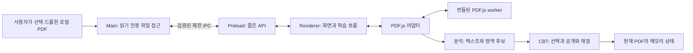

# Local PDF CBT — Project Bible

- 문서 버전: `0.1.4`
- 작성일: 2026-08-31
- 갱신일: 2026-09-01
- 상태: Unit 1.4 PDF 페이지 이동 구현·기능 검사 통과 / 기존 종료 GPU 오류로 전체 완료 보류
- 현재 산출물: 기준 문서, 한국어 Shell, 제한된 PDF 선택·드롭, 로컬 PDF.js 한 페이지 Canvas와 페이지 이동, Windows x64 패키지와 반복 가능한 검사. 배율·CBT 기능은 아직 없다.
- 적용 순서: 사용자의 명시적 지시 → 승인된 Project Bible → ROADMAP → DECISIONS → 구현.
- 문서의 **제안**은 사용자 요구와 구별한다. 이번 개발 승인은 사용자가 명시한 Unit 1.4에 한하며 모든 후속 Unit의 일괄 실행을 뜻하지 않는다.

관련 문서: [개발 계획](ROADMAP.md), [요구사항 검토·기술 결정](DECISIONS.md), [변경·Unit 완료 기록](CHANGELOG.md), [후속 아이디어](IDEA_PARKING.md).

## 1. 프로젝트 목적

사용자가 소유한 문제·보기·해설·정답 PDF를 로컬에서 열어, 답과 해설을 가린 상태로 객관식 문제를 풀게 한다. 답 선택 → 답 확인 → 해당 문제의 해설 공개 → 가능한 경우 채점이 기본 흐름이다. **원본 PDF는 읽기 전용**이며 가림은 화면에서만 수행한다.

사용자가 **Unit 1.4 진행을 명시적으로 요청**했다. Unit 1.3의 읽기 전용 PDF.js 문서 수명 안에서 처음·이전·번호 입력·다음·마지막 페이지 이동을 제공한다. 범위를 벗어난 번호는 현재 페이지를 유지하고, 연속 이동의 이전 렌더 결과는 취소하며, 새 PDF는 1페이지에서 시작한다. Unit 0.4의 GPU 문제와 Unit 1.0 미착수는 완료로 바꾸지 않는다. 확대·축소·너비 맞춤·Text Layer·분석·CBT는 구현하지 않는다. 페이지 이동 기능 검사는 통과했지만 기존 종료 회귀가 실패하여 Unit 전체의 무오류 완료 판정은 보류한다.

### 첫 MVP 범위 — 승인 전 제안

| 구분 | 첫 MVP에서의 처리 |
| --- | --- |
| 실행 대상 | Unit 0.2에서 Windows 11 x64로 확정. 다른 OS/Windows 버전은 현재 지원 검증 대상 아님 |
| UI | 한국어, 한 번에 PDF 한 개와 페이지 한 개 표시 |
| PDF 열람 | 파일 선택, 파일 드롭, 렌더링, 페이지 이동, 확대·축소, 너비 맞춤 |
| CBT 지원 | 검증된 프로파일에 해당하는 단일 열·한 페이지 한 문제. 문제와 해설/정답이 같은 페이지에서 끝나는 형식 |
| 순서 | 문제 → 보기 → 해설 → 정답, 또는 문제 → 보기 → 정답 → 해설 모두 검증 대상 |
| 객관식 | 4지 또는 5지 단일 정답. 보기 수는 자동 추측하지 않고 확인 전 사용자가 선택 가능 |
| 자동 채점 | 정답 영역에서 허용된 표기로 단일 답이 명확히 추출될 때만 시행 |
| 정답 불명 | 해설 가림이 안전하게 추정되면 선택·공개는 가능하되 결과는 `채점 불가` |
| 지원 외 형식 | 가림·문제 대응이 불확실하면 CBT를 시작하지 않음. 안내 후 사용자가 선택하면 원문 열람 |
| 저장 | PDF를 연 동안만 메모리에 선택·공개·채점 상태 유지. 앱 종료, PDF 닫기·교체 시 초기화 |
| 제외 | 자동 문제 분리, 여러 문제/열, 페이지 간 연결, 수동 영역 지정, 영구 저장, OCR, AI |

이는 범용 PDF 지원 약속을 제한하는 제안이다. 해당 제한 없이 임의 PDF를 첫 MVP에서 지원하려면 문제 분리·수동 보정의 일정을 앞당겨 재승인해야 한다. 검증되지 않은 파일을 지원 형식으로 단정하지 않는다.

## 2. Local First 원칙

1. 설치된 앱의 기본 기능은 인터넷 없이 동작한다. 계정·로그인·서버를 요구하지 않는다.
2. PDF, 추출 텍스트, 파일명, 경로, 답안, 로그를 외부로 자동 전송하지 않는다. 분석·크래시 업로드·원격 글꼴·CDN·자동 업데이트 확인을 기본 기능에 넣지 않는다.
3. PDF.js worker와 필요한 CMap·표준 글꼴·WASM 등 렌더링 자산은 앱에 함께 포함하고 패키지 안에서 읽는다. 해당 자산 경로를 지정할 수 있음은 [PDF.js 로딩 API](https://mozilla.github.io/pdf.js/api/draft/api.js.html)에 근거한다.
4. 개발 의존성 다운로드에는 인터넷이 필요할 수 있다. 이는 설치 후 사용 시 오프라인 동작과 구별한다. 개발 서버는 로컬 루프백에만 바인딩하고 배포 앱에는 포함하지 않는다.
5. 향후 AI는 별도 선택 기능이다. 끄거나 연결에 실패해도 파일 열람·풀이·채점·저장은 정상 동작해야 한다.

## 3. 기술 스택

| 기술 | 역할 | 기준 |
| --- | --- | --- |
| Electron | 로컬 데스크톱 창·파일 접근·실행 환경 | 유지보수 중인 안정판을 Unit 0.2에서 검증 후 고정 |
| Node.js LTS / npm | 개발·빌드 도구 | 개발용 Node와 Electron 내장 Node는 별도 런타임 |
| Vite | renderer 개발 서버와 정적 자산 번들 | Vanilla JavaScript 구성 |
| JavaScript / HTML / CSS | UI와 도메인 로직 | React, Vue, TypeScript 전환은 현재 범위 밖 |
| PDF.js / `pdfjs-dist` | PDF 표시·텍스트 추출 | 본체·worker·자산 버전을 동일하게 고정 |
| SQLite / Chart.js / AI | 이후 저장·통계·선택적 확장 | 필요한 Phase 전에는 설치·구현하지 않음 |

Unit 0.2에서 고정한 Electron 44.0.0, Vite 8.2.2, Electron Packager 20.3.0, Prettier 3.9.6을 유지한다. Unit 0.4에서 Node 24.19.0/24.20.0과 npm 11.19.0을 검증하고 packageManager를 npm 11.19.0으로 갱신했다(이전 npm 기준 10.8.2). 직접 의존성은 정확한 버전, 전체 의존성은 lockfile로 관리한다. 개발 Node는 24.19 이상인 24 LTS로 제한하고 `.node-version`은 24.19.0을 유지한다. Electron 내장 Node는 별도로 관리된다. [Node.js 지원 정책](https://nodejs.org/en/about/previous-releases), [Vite 환경 요구사항](https://vite.dev/guide/).

환경 검사는 Node 내장 테스트 실행기와 개발 전용 playwright-core 1.62.1을 사용한다. 별도 브라우저·제품 런타임 의존성은 추가하지 않으며 테스트 도구는 앱 패키지에 포함하지 않는다.

Unit 1.3에서 `pdfjs-dist` 6.3.289를 정확한 버전으로 고정했다. 본체와 worker를 같은 패키지에서 빌드하고 CMap·ICC·표준 글꼴·WASM·라이선스를 로컬 자산으로 포함한다. 실행·설치 방법은 [README](../README.md), 버전·자산·렌더 수명 결정은 DECISIONS의 ADR-020을 따른다.

## 4. 전체 아키텍처

아래는 전체 목표 설계다. Unit 1.4에서는 선택·드롭이 같은 main 읽기 전용 경계를 사용하고, 승인된 PDF의 이름·크기·바이트만 renderer에 전달한다. 경로는 반환하지 않는다. PDF 어댑터가 PDF.js 객체·worker·현재 한 페이지 렌더·요청 식별자·취소·정리를 소유하며 UI는 1부터 시작하는 페이지 번호와 Canvas 상태만 다룬다. 분석·CBT·데이터 저장은 아직 없다. [Electron 프로세스 모델](https://www.electronjs.org/docs/latest/tutorial/process-model).



| 경계 | 책임 | 하지 않는 일 |
| --- | --- | --- |
| Main | 창 수명, 파일 선택·드롭 검증·읽기, IPC 검증. 영구 저장은 이후 추가 | 문제 인식, 채점, PDF 스크립트 실행 |
| Preload | 사용 목적별 허용 API만 노출 | 범용 파일 읽기·쓰기, 원시 IPC 노출 |
| PDF 어댑터 | 열기·페이지·렌더·추출·취소·자원 해제·좌표 변환 | 문제 의미 판단, 학습 상태 보관 |
| 분석 모듈 | 입력 정규화, 키워드·블록·영역 후보, 근거·실패 이유 | DOM 조작, 정답을 사용자에게 공개할지 결정 |
| CBT 모듈 | 선택·공개 상태 전이, 결정적 채점 | PDF 내부 구조, 파일 접근 |
| UI | 상태 표시, 입력 전달, 레이어 배치 | 독자적인 채점 규칙이나 원본 데이터 변경 |

분석은 PDF.js 원시 객체 대신 작은 데이터 레코드를 받는다. 의존성 방향은 UI → 기능 서비스 → 순수 데이터/규칙이며, PDF 어댑터 밖으로 PDF.js 객체가 퍼지지 않게 한다. 향후 저장·OCR·AI를 연결할 경계만 정의하고 범용 플러그인 프레임워크나 빈 서비스 구현을 미리 만들지 않는다.

## 5. 폴더 구조

현재 프로젝트 문서 루트는 `outputs/local-pdf-cbt/docs/`이다. `local-pdf-cbt/`를 프로젝트 루트로 사용할 수 있도록 문서 내부 경로는 모두 상대 경로로 유지한다. 프로젝트를 이동해도 연결이 유지되어야 한다.

**Unit 1.4에서 사용하는 주요 구조:**

```text
local-pdf-cbt/
├─ docs/                기준 문서 5개
├─ electron/            main·preload·로컬 프로토콜·PDF 선택/드롭/검사
├─ src/main.js          화면 초기화
├─ src/pdf/             PDF.js 어댑터·요청 취소·자원 정리
├─ src/ui/              실행 환경·파일 입력·첫 페이지 Canvas 상태 표시
├─ src/styles/          기본 스타일·Shell 배치
├─ scripts/             Node 검사·개발 실행·패키징
├─ tests/               보안 경계·PDF 어댑터·실제 Electron 환경 검사와 합성 PDF
├─ index.html
├─ vite.config.js
├─ package.json
├─ package-lock.json
└─ README.md
```

**현재 구조에 필요한 Unit에서만 추가·확장할 책임:**

```text
electron/             main, preload, 제한 IPC와 로컬 입출력
src/app/              앱 상태와 기능 간 조정
src/pdf/              PDF.js 어댑터와 좌표 변환
src/analysis/         텍스트·패턴·영역 분석
src/cbt/              선택·공개·채점
src/ui/               화면 요소와 레이어
src/styles/           스타일과 UI 토큰
src/shared/           실제로 공유되는 설정·데이터 계약
tests/                필요한 로직·통합·시나리오 검증
tests/fixtures/       재배포 가능한 합성 PDF와 기대 결과
```

빌드 설정과 패키지 파일은 Unit 0.2에서 추가했고 Unit 0.4에서 실제 Windows x64/ASAR 패키지를 검증했다. 사용자 PDF, 학습 데이터, 로그, 빌드 산출물, 비밀 값은 Git에 넣지 않는다. 저장 서비스 폴더는 저장 기능에 착수할 때 만든다. 앱 ASAR에는 electron/·dist/·package.json만 포함한다. release/와 work/는 각각 생성된 앱과 검증 자료용이며 소스·Git 대상이 아니다.

## 6. 개발 원칙

- 한 Unit의 목적과 완료 조건을 먼저 정한다. 다음 기능을 편의상 끼워 넣지 않는다.
- 정상 동작 중인 기능을 임의로 제거하거나 의미를 바꾸지 않는다. 리팩토링은 이유·영향·회귀 확인을 기록한다.
- 함수·모듈의 책임을 작게 유지한다. 한 파일이 파일 접근, PDF 분석, UI, 채점을 모두 맡지 않는다.
- 비동기 결과는 문서·페이지·렌더 요청 식별자로 검증한다. 취소된 이전 요청이 새 화면이나 답안 상태를 덮어쓰면 안 된다.
- 모든 페이지를 고해상도 Canvas로 상주시키지 않는다. 현재 페이지 중심으로 렌더하고 취소·정리 경로를 둔다. [PDF.js 메모리 안내](https://github.com/mozilla/pdf.js/wiki/Frequently-Asked-Questions#i-want-to-render-all-100-pages-in-a-document-at-a-high-resolution-is-it-a-good-idea).
- 구조 검토는 PDF 영역 분석, 문제 자동 분리, SQLite, 시험 모드, OCR, AI 착수 전 필수다. 동작 시연만으로 통과시키지 않는다.

## 7. 코딩 규칙

- JavaScript는 ES Modules를 기본으로 한다. sandbox preload의 모듈 형식 등 런타임 제약으로 필요한 예외는 DECISIONS에 기록한다.
- 2칸 들여쓰기, 세미콜론, 작은따옴표를 기본으로 하고 Unit 0.2에서 고정한 Prettier 설정을 따른다. 기존 문서의 불필요한 전체 재정렬은 피한다.
- 공개 함수와 데이터 계약은 JSDoc으로 입력·출력·실패 상태를 설명한다. 주석은 동작 나열보다 제약의 이유를 남긴다.
- `const` 우선, 불필요한 전역 상태 금지, 사용자/PDF 텍스트는 HTML로 삽입하지 않는다.
- 예상 가능한 취소·미지원·손상은 명시적 상태로 처리한다. 예외를 무시하거나 오류 로그를 숨겨 완료 조건을 맞추지 않는다.
- 임계값·키워드·여백·메모리 제한은 이름 있는 설정값으로 관리한다. 샘플의 좌표를 일반 규칙처럼 하드코딩하지 않는다.

## 8. 네이밍 규칙

| 대상 | 규칙 / 예 |
| --- | --- |
| 파일·디렉터리 | `kebab-case`, 예: `pdf-adapter.js`, `answer-parser.js` |
| 함수·변수 | `camelCase`, 예: `extractAnswer`, `selectedChoice` |
| 타입 문서·클래스 | `PascalCase`, 예: `Question`, `Attempt` |
| 상수 | `UPPER_SNAKE_CASE`, 예: `MAX_CANVAS_PIXELS` |
| 불리언 | `is`, `has`, `can`, 예: `canReveal` |
| 식별자 | `documentId`, `questionId`, `regionId`; 서로 바꿔 쓰지 않음 |
| 페이지 | `pageNumber` / 외부 레코드의 `page`는 1부터. 배열 인덱스와 혼용 금지 |
| 단위 | `scale`, `durationMs`, `sizeBytes`; 좌표에는 공간·단위를 명시 |

## 9. PDF 처리 원칙

### 9.1 추출과 분석은 다른 일이다

`getTextContent()`는 텍스트 항목을 제공한다. 항목의 `str`, `transform`, `width`, `height`, `dir`, `hasEOL` 등을 이용할 수 있지만 문제·해설이라는 의미는 앱이 판단해야 한다. [PDF.js TextItem 계약](https://mozilla.github.io/pdf.js/api/draft/module-pdfjsLib.html#~TextItem).

Text Content는 분석 입력이고 Text Layer는 표시·선택을 위한 DOM이다. 렌더된 DOM의 순서나 화면 픽셀을 분석의 원본으로 사용하지 않는다. 텍스트 추출 가능 여부와 정상적인 읽기 순서·한글 품질은 별도로 검증한다.

내부 `TextItemRecord`는 `text`, `x`, `y`, `width`, `height`, `page`를 제공한다. 이 필드는 원시 API 값을 그대로 복사한 것이 아니라 아래 기준으로 정규화한 값이다. 원문, 원시 transform, font 정보, 항목 ID도 근거 추적에 필요한 만큼 유지한다.

### 9.2 좌표 계약

- 저장·분석의 기준은 **페이지의 회전 전 PDF user space**다. `coordinateSpace: pdf-user-space`, `x/y: 추정 bbox의 최소 좌표`, `width/height: bbox의 크기`로 정의한다. 단위는 PDF user unit이며 무조건 CSS px 또는 1/72 inch로 취급하지 않는다.
- 페이지의 view box, `userUnit`, 고유 회전을 함께 보관한다. 텍스트 기준선의 transform 위치를 bbox 왼쪽 위라고 단정하지 않는다. 글꼴 ascent/descent와 회전된 모서리를 고려한 경계 상자는 근사치이며 실물 검증이 필요하다.
- 화면 배치는 동일 viewport로 모든 모서리를 변환한 후 CSS px 경계를 계산한다. Canvas의 고해상도 픽셀 배율과 overlay의 CSS 좌표를 분리한다. 확대·맞춤·회전·창 크기 변경마다 다시 투영한다.
- PDF ↔ viewport 변환, 회전, view box, userUnit 처리는 PDF.js 공개 변환을 우선 사용한다. [PageViewport 공식 소스](https://raw.githubusercontent.com/mozilla/pdf.js/master/src/display/page_viewport.js), [HiDPI 렌더링 예제](https://mozilla.github.io/pdf.js/examples/).
- Unit 2.2에서 버전별 API와 bbox 계산을 검증한다. 다각형·기울어진 글자는 향후 확장 가능성을 두되 MVP 지원 밖이면 명시적으로 보류한다.

### 9.3 영역 추정 파이프라인 — 설계 제안

1. 페이지별 텍스트 품질을 평가한다.
2. 분리된 항목을 줄·블록으로 묶고 원문과 검색용 정규화 문자열을 함께 유지한다.
3. `해설`, `풀이`, `정답`, `답`, `Solution`, `Explanation`, `Answer`를 설정 가능한 후보로 찾는다. 짧은 `답`은 문장 내 부분 일치로 쓰지 않는다.
4. 줄 시작, 구분 기호, 주변 문맥, 보기 영역과의 관계를 함께 검사한다. `정답을 고르시오` 같은 지시문은 해설 제목이 아니다.
5. 시작 키워드뿐 아니라 블록 끝, 열 경계, 다음 제목, 본문/보기와의 겹침을 확인한다. 분리된 해설·정답은 여러 사각형으로 표현한다.
6. 영역 가림 적합성과 정답 추출 적합성을 별도로 판정한다. `supported / uncertain / unsupported`와 근거·사유를 남긴다. 점수가 있다면 보정 전의 휴리스틱 점수이지 정확도 확률이 아니다.

고정 Y 이하 전체 가리기와 키워드 일치만으로 자동 공개·채점하는 방식을 금지한다. 끝 경계를 입증하지 못한 영역은 추측해서 사용하지 않는다. 정답·해설 안의 그림과 수식도 가림 대상이므로 텍스트 bbox의 합집합만으로 완전한 가림을 보장하지 않는다.

### 9.4 스캔·혼합 문서

문서 전체를 이분법으로 분류하지 않고 **페이지별** `text-usable`, `text-insufficient`, `unknown` 상태를 둔다. 빈 텍스트는 스캔뿐 아니라 빈 페이지·윤곽선 글자·인코딩 문제일 수 있다. 페이지 번호만 추출되거나 OCR 텍스트가 깨진 페이지도 분석 불충분일 수 있다.

문자량·좌표 유효성·문자 품질을 먼저 보고, 필요 시 이미지 연산과 면적을 보조 신호로 검토한다. 임계값은 Unit 2.1 샘플 검증으로 정한다. MVP는 `스캔 또는 텍스트 분석 불가`라고 안내하며 OCR을 자동 실행하지 않는다. 혼합 PDF의 한 페이지 실패가 나머지 페이지 열람을 막지 않게 한다.

### 9.5 화면 레이어와 공개

아래는 동일 페이지 컨테이너 안에서 아래 → 위 순서다.

```text
PDF Canvas                 원본 페이지 렌더링
Text Layer                 선택 가능한 텍스트, 가린 내용의 우회 노출 방지
Answer/Solution Mask Layer questionId에 연결된 불투명 사각형들
CBT Interaction Layer      현재 문제의 상호작용과 상태
Loading/Uncertain Cover    준비 전·실패 시 페이지 전체를 가리는 임시 덮개
```

- MVP 기본은 불투명 Overlay다. Blur/Mosaic의 시각 효과는 이후 검토한다. 원본 PDF와 원본 렌더 픽셀을 수정하는 편집 기능이 아니다.
- CBT에서는 분석·Canvas·Text Layer·Mask가 모두 준비될 때까지 전체 덮개를 유지한다. 새 페이지나 확대 과정에서 정답이 한 프레임 먼저 보여서는 안 된다.
- 불확실하면 전체 덮개를 유지하고 이유, 다시 시도, 명시적인 `원문 보기` 선택을 제공한다. 원문 보기는 정답 노출 가능성을 알리고 해당 페이지를 풀이 대상에서 제외한다.
- `답 확인`은 현재 `questionId`의 마스크만 공개한다. 페이지 이동이나 확대는 공개 명령이 아니다. 여러 문제·여러 페이지용 소유 관계는 데이터로 준비하되 기능 구현은 Phase 4다.
- 가린 텍스트는 선택·복사·포커스·접근성 읽기 경로에서도 우발적으로 드러나지 않도록 처리한다. 가능하면 해당 span을 제외하고, 경계가 불명확하면 해당 페이지 Text Layer 상호작용 전체를 공개 전 비활성화한다. 접근성 제한은 숨기지 않고 기록한다.
- 이 장치는 학습 보조다. 개발자 도구·원본 파일 접근 등을 막는 DRM이나 시험 부정행위 방지 기능이 아니다.
- Phase 1~2의 개발용 PDF/Debug 화면은 CBT가 아니며 원문이 노출될 수 있음을 표시한다. MVP의 공개 전 차단 조건은 Unit 3.1 이후 적용한다.

## 10. UI 기본 원칙

향후 PDF/CBT 화면에서는 파일 열기와 상태 안내를 상단, 페이지·배율 조절을 PDF 주변, 선택지·답 확인·결과를 학습 패널에 배치하는 단순한 구성을 제안한다. 미구현 미래 기능의 버튼은 만들지 않는다.

Unit 0.3 Shell의 1120×760 기본 창과 640×480 최소 창을 유지한다. Unit 1.1의 선택 버튼과 Unit 1.2의 드롭은 같은 읽기 경계를 사용한다. Unit 1.3의 scale 1 viewport와 디스플레이 픽셀 비율을 유지하면서 Unit 1.4는 현재 한 페이지만 Canvas에 표시하고 처음·이전·번호 입력·다음·마지막 이동을 제공한다. 페이지 번호는 1부터 시작하고 범위 밖 정수·소수·빈 값은 PDF.js에 페이지로 전달하지 않으며 현재 페이지를 유지한다. 빠른 연속 이동은 이전 요청을 취소하고 마지막 요청만 상태를 갱신하며 새 파일은 1페이지로 초기화한다. 파일 입력 실패·취소는 이전 성공 화면을 유지하지만, 새 파일이 암호 필요·손상으로 판정되면 이전 Canvas를 숨기고 새 오류를 표시한다. 이름은 textContent로, 상태는 문구와 role=status로 전달한다. 배율·학습 제어는 만들지 않으며 선택과 PDF.js 객체는 새로고침·교체·종료 시 정리한다.

| 상태/행동 | 규칙 |
| --- | --- |
| 파일 없음 | 열기·드롭 안내. 답 확인 비활성화 |
| 로딩·분석 중 | 진행 상태와 취소/파일 교체. CBT에서는 페이지 덮개 유지 |
| 미선택 | 하나를 선택하기 전 답 확인 비활성화 |
| 선택 완료 | 하나만 선택. 답 확인 전 선택과 보기 수 변경 가능; 보기 수 변경 시 선택 초기화 |
| 답 확인 | 선택을 잠그고 해당 문제 해설 공개. 중복 클릭으로 기록 중복 생성 금지 |
| 정답 명확 | `맞음` 또는 `틀림`, 사용자 선택과 추출 정답 표시 |
| 정답 불명·충돌 | `채점 불가`, 자동 판정하지 않았다는 설명. 틀림으로 집계하지 않음 |
| 페이지 재방문 | 같은 PDF가 열린 동안 선택·공개·결과 유지 |
| 파일 교체·종료 | 메모리 상태 초기화. 저장되지 않음을 UI에서 안내 |

첫 MVP는 페이지 탐색이다. 버튼을 `이전 문제/다음 문제`로 잘못 표시하지 않는다. 문제 탐색은 Phase 4 이후 추가한다. 같은 질문의 다시 풀기·시도 누적은 Phase 5로 유보한다.

색상만으로 선택·정오를 전달하지 않는다. 실제 button/radio, 키보드 이동, 포커스 표시, 상태 메시지의 접근성을 고려한다. 가림과 접근성이 충돌하는 경우 해설을 몰래 읽히게 하지 말고 한계를 알린다.

## 11. 데이터 관리 원칙

MVP 데이터는 필요한 Unit에서만 도입하는 메모리 레코드다. 아래는 DB 설계나 즉시 구현할 전체 클래스 목록이 아니다.

| 개념 | 최소 계약 / 용도 |
| --- | --- |
| PdfDocument | 세션 내 `documentId`, 표시 이름, 페이지 수. 원본 경로는 가능하면 main만 보유 |
| PageAnalysis | 문서·페이지·분석 버전, 텍스트 상태, 지원 상태, 근거·실패 사유 |
| Question | 독립 `questionId`, `documentId`, `sourceKind: page-single`, `pageRefs[]`, `regionIds[]`, 보기 수 |
| Region | `regionId`, `questionId`, `page`, `kind: answer/solution`, 좌표 공간, `rects[]`, 출처·근거 |
| Answer | `questionId`, `value: 1..5 또는 null`, `status: known/unknown/ambiguous`, 추출 근거. 가림 적합성과 독립 |
| Attempt | 현재 연 문서에서 문제별 선택, 공개 여부, `ungraded/correct/incorrect/ungradable`. 답 확인 시 확정 |

정답은 해당 질문의 정답 영역에서만 추출한다. `①`~`⑤`, 숫자 1~5와 허용 구분 표기를 정규화하되 모든 숫자를 답으로 읽지 않는다. 복수 후보·범위 밖 번호·보기 수 불일치·복수 정답은 `unknown/ambiguous`로 남기고 채점하지 않는다.

페이지 번호를 questionId로 취급하지 않는다. 첫 MVP에서는 Question 하나의 pageRefs 길이가 1이지만 Phase 4에서 여러 페이지/영역으로 확장 가능해야 한다. 새 PDF 열기와 재분석 시 오래된 ID·선택·결과가 섞이지 않게 한다.

영구 저장은 Phase 5다. 도입 시 콘텐츠 해시 등 문서 식별, 규칙 버전·스키마 버전, 원본 변경 감지, 백업·복구·삭제 정책을 함께 설계한다. 파일명이나 경로만으로 같은 PDF를 판별하지 않는다. 북마크·학습 세션은 그때 추가하고 오답 목록은 Attempt의 파생 조회를 우선 검토한다.

## 12. 보안 원칙

Electron 권고에 따라 renderer의 `nodeIntegration: false`, `contextIsolation: true`, `sandbox: true`를 명시하고 `webSecurity`를 유지한다. CSP, IPC 발신자 검증, 제한된 API, 탐색·새 창 제한을 적용한다. [Electron 보안 지침](https://www.electronjs.org/docs/latest/tutorial/security).

프로젝트의 추가 정책은 다음과 같다.

- 로컬 PDF도 신뢰하지 않는 입력이다. PDF 내 JavaScript, 첨부 실행, 외부 URI 자동 열기, 원격 자원 요청을 기본 허용하지 않는다.
- 파일 선택/드롭으로 승인된 PDF만 읽는다. 범용 `readFile(path)`나 임의 경로 쓰기를 renderer에 제공하지 않는다. 확장자·기본 서명·크기·읽기 가능 여부를 확인하되 최종 구조 유효성은 PDF 파서가 판정한다.
- 배포 앱은 로컬 자산 전용 프로토콜을 우선 검증하고 허용 경로를 제한한다. 개발 서버용 예외가 배포 CSP·네트워크 정책에 남으면 안 된다.
- 허용된 앱 자산 외 네트워크 요청과 권한 요청을 기본 거절한다. 로컬 원본 선택이 폴더 전체나 다른 파일 읽기 허용을 뜻하지 않는다.
- MVP에서 암호가 필요한 PDF는 명확한 미지원 안내 후 종료한다. 암호 입력 UI는 별도 후속 Unit으로 둔다. 손상·접근 거부·초대형 파일에서도 앱 전체가 멈추지 않아야 한다.
- 원문, 추출 정답, 개인 경로를 상시 로그에 남기지 않는다. 진단 결과 내보내기도 사용자가 요청할 때만 한다.
- 의존성 보안 업데이트는 오프라인 원칙과 별개로 개발자가 관리한다. 앱 자동 전송이나 자동 업데이트 서버를 먼저 추가하지 않는다.

## 13. Unit 개발 규칙

Unit 시작 시 목표, 제외 범위, 선행 Unit, 완료 기준을 확인한다. 구현 → 실행 가능한 검증 → 구조/회귀 검토 → 문서 갱신 순서로 마친다. 현재 Unit의 기준을 충족하지 못하면 다음 Unit으로 넘어가지 않는다.

이번 순서 조정은 사용자의 명시적 Unit 1.1과 1.2 요청에 한한다. 미착수 Unit 1.0을 완료로 바꾸거나 기존 오류 없음 조건을 낮추지 않는다. 최소 입력 상한·서명 정책은 ADR-017/018, 드롭 경계는 ADR-019에 기록한다.

각 Unit 완료 기록에는 반드시 다음 10항목을 넣는다.

1. 구현한 내용
2. 수정/생성된 파일
3. 실행 방법
4. 사용자가 직접 테스트할 방법
5. 정상 동작 기준
6. 예상되는 Edge Case
7. 알려진 제한사항
8. Technical Debt
9. 다음 Unit 진행 전 수정이 필요한 사항
10. Git Commit Message

문서 전용 Unit은 실행 방법에 `문서 열람`, 런타임 검증에 `해당 없음`을 명시한다. 코드를 실행하지 않은 상태에서 Console Error 없음이라고 판정하지 않는다. Unit 0.1 기록은 [CHANGELOG](CHANGELOG.md)에 둔다. 향후 기록 파일을 늘릴지는 필요할 때 결정한다.

## 14. 테스트 원칙

- 테스트 결과는 `통과 / 실패 / 미실행 / 해당 없음`으로 구분하고 대상 환경·입력·기대/실제 결과를 기록한다.
- 앱 Unit은 main, renderer, worker의 미처리 예외·Console Error가 없어야 한다. 예상되는 잘못된 파일 입력은 처리된 안내 상태로 끝나야 한다. 로그 삭제는 해결이 아니다.
- 순수 규칙에는 필요한 단위 검증을, 경계에는 통합 검증을, 가림에는 실제 화면 검증을 사용한다. 구현을 그대로 복제한 테스트나 저위험 문구 변경용 테스트는 만들지 않는다.
- PDF 렌더링 정상과 해설 탐지 정확도를 분리한다. 매칭률 한 개로 가림 누락·과도한 가림·오채점을 숨기지 않는다.
- 한글 분절, 4/5지, A/B 순서, 다문제·다단·페이지 연결, 스캔·혼합, 회전·확대·DPI, 손상·암호·대용량을 샘플 행렬로 관리한다.
- 지원한다고 선언할 고정 샘플 세트에서 정답/해설 누출·문제/보기 침범·잘못된 자동 채점이 없어야 한다. 미지원 세트는 안전하게 보류해야 한다. 이는 해당 세트의 통과 기준이며 전체 PDF에 대한 정확도 보장이 아니다.
- 배포 패키지를 개발 서버 없이 네트워크 차단 환경에서 검증한다. 원본 PDF의 사용 전후 해시를 비교해 변경되지 않았는지 확인한다.
- 성능 숫자는 측정 환경과 함께 정한다. 지금 임의의 로딩 시간·최대 크기·정확도 수치를 제품 보장으로 적지 않는다.

## 15. Git Commit 규칙

- 관련 변경 한 단위를 설명하는 커밋을 권장한다. 실제 커밋은 별도 요청이나 해당 작업 범위가 있을 때만 한다.
- 형식: `type(scope): 변경 목적`, 예: `docs(foundation): define project bible and phased roadmap`.
- `feat`, `fix`, `refactor`, `test`, `docs`, `build`, `chore`를 의미에 맞게 사용한다. 관련 Unit과 테스트 결과는 본문에 쓸 수 있다.
- 사용자 변경을 덮어쓰거나 요청 없이 커밋 이력·원격 저장소를 변경하지 않는다. 커밋 메시지 제안과 실제 커밋 완료를 구분한다.

## 16. 코드 리뷰 체크리스트

- [ ] 현재 Unit의 범위만 구현했는가?
- [ ] Local First와 원본 읽기 전용 원칙을 지켰는가?
- [ ] IPC·파일 경로·프로세스 권한 경계가 좁고 검증되는가?
- [ ] PDF 좌표 공간과 CSS/Canvas 픽셀 배율이 혼동되지 않는가?
- [ ] 늦은 렌더·분석 결과, 빠른 탐색, 파일 교체가 상태를 오염시키지 않는가?
- [ ] 불확실한 인식이 답 누출이나 오채점으로 이어지지 않는가?
- [ ] 공개가 questionId 기준이며 다른 문제를 풀어주지 않는가?
- [ ] 미지원 입력·취소·오류 안내·접근성 한계가 명시적인가?
- [ ] 메모리·worker·이벤트·Canvas 정리와 제한이 있는가?
- [ ] 검증을 실제 수행했고 미실행 항목·제한·부채를 기록했는가?
- [ ] ROADMAP, DECISIONS, CHANGELOG가 구현 상태와 일치하는가?

## 17. 향후 AI 확장 원칙

AI는 분석·학습 데이터 경계 밖의 선택 서비스로 분리한다. 기본 흐름에 API 키나 AI 호출을 요구하지 않는다. 도입 전 목적별 입력 최소화, 전송 대상·내용 미리보기, 사용자의 명시적 실행, 비용 안내, 취소·실패·비활성화 경로를 설계한다.

PDF 내용은 데이터이지 시스템 지시가 아니다. 문서에 포함된 명령으로 파일 읽기·외부 전송 범위를 넓히지 않는다. AI 생성 결과에는 출처·생성 여부를 표시하고 검토 없이 정답 원본이나 기존 채점 규칙을 덮어쓰지 않는다. 로컬 모델을 쓰더라도 품질·리소스·모델 라이선스를 별도로 검증한다.

## 18. 금지사항

- 사용자가 요청하지 않은 다음 Unit 착수, 전체 Phase 일괄 구현, 미래 기능용 불필요한 의존성·DB 선행 구축.
- 원본 PDF 편집·덮어쓰기, 사용자가 고르지 않은 문서 자동 수집, 외부 자동 업로드.
- 고정 페이지 좌표를 범용 분석으로 취급하거나 키워드 하나만으로 해설 전체를 찾았다고 주장하기.
- 단일 페이지를 영구적인 문제 ID로 사용하거나 다문제 페이지 전체를 한 번에 공개하기.
- 불명확한 답을 임의 채점, 추출 실패를 틀린 답으로 처리, 실제 측정 없는 정확도 주장.
- 가림 준비 전 답 노출, Debug Overlay·도움말·텍스트 복사 경로를 통한 우발적 정답 공개.
- 편의를 위한 sandbox/context isolation 해제, 원시 파일·IPC 권한 노출.
- 미실행 테스트를 통과로 기재, Console Error를 숨겨 완료 처리.

이 기준을 바꿀 때는 먼저 영향과 이유를 DECISIONS에 남기고 ROADMAP·관련 Unit 조건을 함께 수정한다. 사용자 요구 범위나 데이터 전송·보안 경계를 바꾸는 결정은 사용자 승인 없이 진행하지 않는다.
